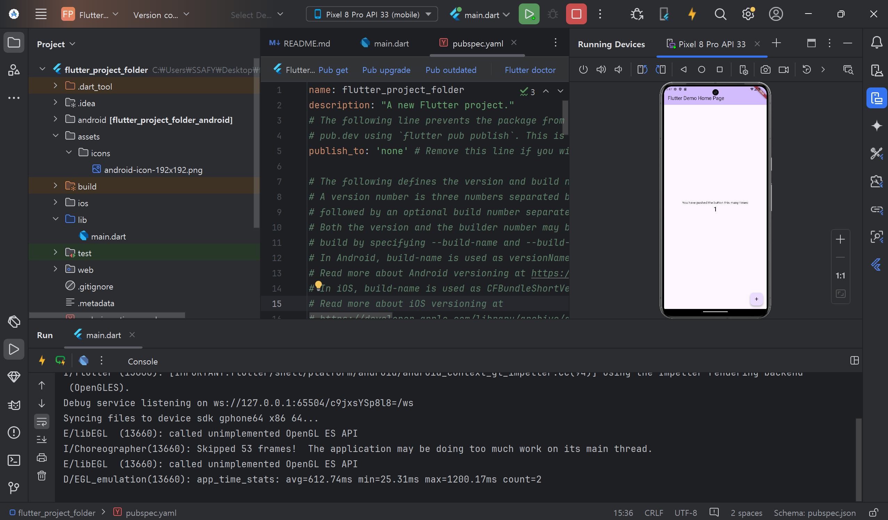

# Flutter SDK 다운로드

# 안드로이드 스튜디오 설치

# Flutter SDK 환경 변수 설정

### 에뮬레이터란

에뮬레이터(Emulator)**는 실제 물리적 기기 없이, 컴퓨터 상에서 가상 기기를 만들어 앱을 테스트하거나 실행할 수 있는 소프트웨어이다.

# 에뮬레이터 다운로드 후 카운터 앱 실행

## 여기서 10분 이상 걸림. 정상 작동 확인

# 내일은 앱을 배포하고 google store 에 등록하는 법을 배울 예정
