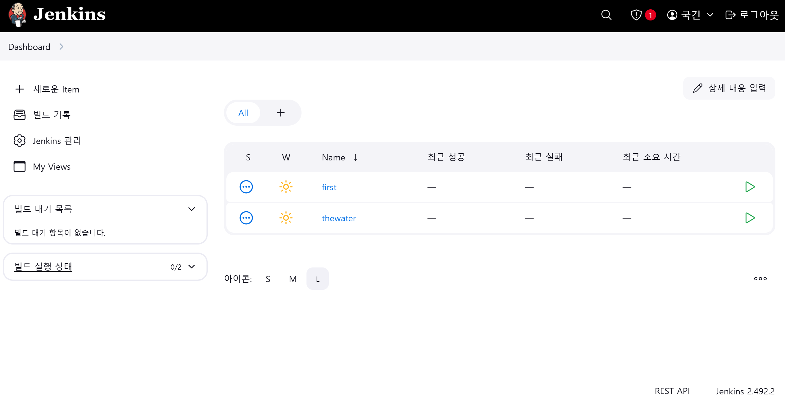

# 250307 특화 프로젝트 - FE 개발 생산성 향상, 꼭 알아야 할 AI 도구

### Gemini code assist

### AI code helper

### tldraw 의 MakeReal

### tldraw 의 drawfast

# AWS EC2 에서 도커 설치하기

```
# 시스템 업데이트

sudo apt update
sudo apt install -y ca-certificates curl gnupg

# Docker의 공식 GPG 키 설정 (새로운 방식)

sudo install -m 0755 -d /etc/apt/keyrings
curl -fsSL https://download.docker.com/linux/ubuntu/gpg | sudo gpg --dearmor -o /etc/apt/keyrings/docker.gpg
sudo chmod a+r /etc/apt/keyrings/docker.gpg

# Docker 리포지토리 설정

echo "deb [arch=$(dpkg --print-architecture) signed-by=/etc/apt/keyrings/docker.gpg] https://download.docker.com/linux/ubuntu $(lsb_release -cs) stable" | sudo tee /etc/apt/sources.list.d/docker.list > /dev/null

# 다시 업데이트하고 Docker 설치

sudo apt update
sudo apt install -y docker-ce docker-ce-cli containerd.io docker-buildx-plugin docker-compose-plugin

```

## 그리고 sudo 없이 Docker를 사용하기

```
sudo usermod -aG docker $USER
newgrp docker
```

이 명령어를 실행하지 않으면 소켓 접근 권한 에러가 뜬다

## claude 피셜 Docker로 Jenkins 실행 및 GitLab 연동 가이드

1. Docker를 사용하여 Jenkins 컨테이너 실행
2. Jenkins 초기 설정을 위한 관리자 비밀번호 확인
3. GitLab 연동에 필요한 Jenkins 플러그인 설치
4. SSH 키 생성 및 GitLab에 등록
5. GitLab Access Token 생성
6. Jenkins에 GitLab Credentials 추가
7. Jenkins에 GitLab 서버 연결 설정
8. Jenkins Pipeline 작업 생성 예시
9. GitLab 웹훅 설정으로 자동 빌드 트리거 구성

```
# 1. Jenkins Docker 이미지 실행하기
docker run -d --name jenkins -p 8080:8080 -p 50000:50000 \
  -v jenkins_home:/var/jenkins_home \
  -v /var/run/docker.sock:/var/run/docker.sock \
  jenkins/jenkins:lts

# 2. Jenkins 초기 설정 비밀번호 확인
docker logs jenkins | grep -A 3 "initialAdminPassword"

# 3. 필요한 플러그인 설치
# Jenkins 웹 인터페이스에서 다음 플러그인 설치 필요:
# - GitLab Plugin
# - Git Integration Plugin
# - Credentials Plugin
# - Pipeline Plugin

# 4. GitLab과 Jenkins 연동을 위한 SSH 키 생성
# Jenkins 컨테이너 내부에 접속
docker exec -it jenkins bash

# Jenkins 컨테이너 내부에서 SSH 키 생성
mkdir -p /var/jenkins_home/.ssh
ssh-keygen -t rsa -b 4096 -C "jenkins@example.com" -f /var/jenkins_home/.ssh/id_rsa
cat /var/jenkins_home/.ssh/id_rsa.pub
# 출력된 공개키를 GitLab에 등록해야 합니다
exit

# 5. Jenkins에 GitLab Access Token 설정
# GitLab에서:
# - 사용자 설정 > 엑세스 토큰으로 이동
# - 이름: jenkins-integration
# - 범위 선택: api, read_repository, write_repository
# - 토큰 생성 후 복사

# 6. Jenkins에 GitLab Credentials 추가
# - Jenkins 관리 > Credentials > System > Global credentials > Add Credentials
# - Kind: GitLab API token
# - Scope: Global
# - API token: GitLab에서 복사한 토큰 붙여넣기
# - ID: gitlab-token
# - Description: GitLab API Token

# 7. Jenkins에 GitLab 연결 설정
# - Jenkins 관리 > System Configuration > 시스템 설정
# - GitLab 섹션에서 'Add GitLab Server' 클릭
# - Connection name: GitLab
# - GitLab host URL: https://your-gitlab-instance.com/
# - Credentials: 위에서 추가한 Credentials 선택
# - Test Connection 클릭하여 연결 확인

# 8. 샘플 Pipeline 작업 생성
# - Jenkins 대시보드에서 '새로운 Item' 선택
# - 이름 입력 후 'Pipeline' 선택하고 OK 클릭
# - Pipeline 스크립트 추가:

# Pipeline 스크립트 예시:
pipeline {
    agent any

    stages {
        stage('Clone') {
            steps {
                git branch: 'main',
                    url: 'https://your-gitlab-instance.com/your-group/your-project.git',
                    credentialsId: 'gitlab-token'
            }
        }
        stage('Build') {
            steps {
                sh 'echo "Building project"'
                // 실제 빌드 명령어 추가
            }
        }
        stage('Test') {
            steps {
                sh 'echo "Running tests"'
                // 실제 테스트 명령어 추가
            }
        }
    }
}

# 9. GitLab 웹훅 설정
# - GitLab 프로젝트 > Settings > Integrations
# - URL: http://your-jenkins-url:8080/project/your-project-name
# - 트리거: Push events, Merge Request events 등 선택
# - SSL 검증 비활성화 (필요시)
# - Add webhook 클릭
```


