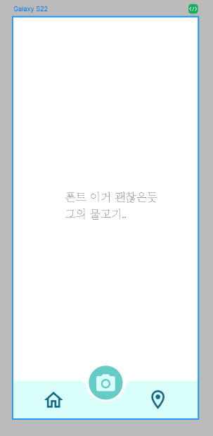

# Cursor

Cursor는 AI 기반의 코드 에디터로, 개발자의 생산성을 크게 향상시켜주는 도구이다.

cursor = chatGPT + vscode 느낌이다

특히 커맨드를 단계단계 실행해줘서 정말 편리하다.

## 주요 기능

### 1. AI 코드 자동완성

### 2. 코드 리팩토링

### 3. 코드 설명 및 문서화

### 4. 채팅 기반 코드 지원

## 장점

- VS Code와 유사한 인터페이스로 쉽게 적응 가능
- 무료 버전으로도 충분한 기능 제공
- 다양한 프로그래밍 언어 지원
- 실시간 협업 기능 제공

## 단점

- 때때로 네트워크 의존적인 성능
- 제안된 코드가 항상 최적이지는 않음

# Cursor을 활용해 flappy bird 앱 빌드하고 설치하기

앱을 빌드한다는 것은 .apk 파일을 만든다는 것이다.

cursor 의 agent 프롬프트에 main.dart 파일을 flappy bird 앱으로 만들어달라고 입력하면 코드를 수정해준다.

그 후

```
flutter build apk --release
```

실행하면 build 폴더의 특정 위치에 .apk 파일이 생성되는데

이 .apk 파일을 핸드폰의 다운로드 폴더에 옮겨서 실행하면 앱이 설치된다.

# 추가로 앱 하단 바 디자인


