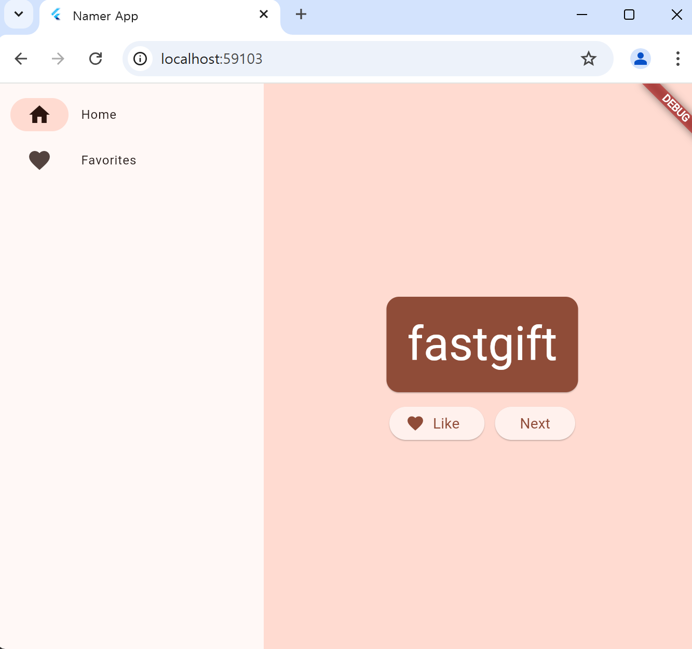

# Flutter 

Flutter 코드에서는 후행 쉼표를 많이 사용한다.

Ctrl + . 커맨드로 Refactor 메뉴를 불러 올 수 있다.

Refactor 에서 Extract Widget 을 선택하면 현재 선택된 부분을 개별 위젯으로 만들어준다.

Refactor 에서 Wrap with Padding 을 선택하면 선택된 부분을 Padding 이라는 상위 위젯으로 감싸준다.

# flutter 로 간단한 앱 만들기

MyApp의 코드는 전체 앱을 설정한다. 즉 앱 전체 상태를 생성하고고 앱의 이름을 지정하고 시각적 테마를 정의하고 '홈' 위젯을 설정한다.

MyAppState 클래스는 앱의 상태를 정의한다.

Flutter에는 앱 상태를 관리하는 강력한 방법이 여러 가지 있는데 이 중 가장 쉬운 접근방식인 ChangeNotifier를 사용한다.

상태 클래스는 ChangeNotifier를 확장한다. 즉, 자체 변경사항에 관해 다른 항목에 알릴 수 있다. 예를 들어 현재 단어 쌍이 변경되면 앱의 일부 위젯이 인식할 수 있다.

MyAppState는 앱이 작동하는 데 필요한 데이터를 정의한다.

## MyHomePage

1. 모든 위젯은 위젯이 항상 최신 상태로 유지되도록 위젯의 상황이 변경될 때마다 자동으로 호출되는 build() 메서드를 정의한다.

2. MyHomePage는 watch 메서드를 사용하여 앱의 현재 상태에 관한 변경사항을 추적한다.

3. 모든 build 메서드는 위젯 또는 중첩된 위젯 트리(좀 더 일반적임)를 반환해야 한다. 여기서 최상위 위젯은 Scaffold. 여기선 사용하지 않지만 유용한 위젯이며 대부분의 실제 Flutter 앱에서 찾을 수 있다.

4. Column은 Flutter에서 가장 기본적인 레이아웃 위젯 중 하나다. 하위 요소를 원하는 대로 사용하고 이를 위에서 아래로 열에 배치한다. 기본적으로 열은 시각적으로 하위 요소를 상단에 배치한다. 열이 중앙에 위치하도록 이를 곧 변경한다.

5. 이 두 번째 Text 위젯은 appState를 사용하고 해당 클래스의 유일한 멤버인 current(즉, WordPair)에 액세스한다. WordPair는 asPascalCase 또는 asSnakeCase 등 여러 유용한 getter를 제공한다. 여기서는 asLowerCase를 사용하지만 대안 중 하나가 더 좋다면 지금 변경해도 된다.

MyAppState 에 <WordPair>[] 타입 favorites 속성을 추가해서 MyApp 위젯에서 불러와 사용할 수 있다.

Stateful 위젯과 Stateless 위젯의 차이점

