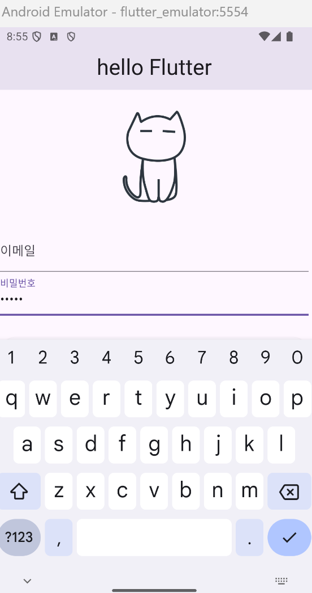

# EC2 서버 받았다 드디어!!

# EC2 에 도커 설치하기 

먼저 아래 메뉴얼들을 따라서 도커를 설치하고 젠킨스 컨테이너를 실행해주었다.

https://docs.docker.com/engine/install/ubuntu/

프로젝트 싸피의 help의 메뉴얼의 젠킨스 설치 가이드

https://lab.ssafy.com/common-files/manual/-/blob/master/jenkins/CICD_Jenkins_install_guide_code.txt

## 젠킨스 버전으로 인한 경고 해결

젠킨스 lts 버전으로 컨테이너 실행하니까 웹 인터페이스에서 젠킨스 버전이 낮아 각종 플러그인을 설치하지 못했다고 경고 메세지가 떴다. 그래서 이 젠킨스 컨테이너 중지 후 삭제하고, 다시 젠킨스 latest 버전으로 컨테이너를 실행했다. 이러고 나니까 경고메시지가 싹 사라졌다.

## Gitlab Token 발급받기

jenkins 가 git clone 받을 때 필요한 토큰을 미리 발급 받아놓았다.

## jenkins Credential 에 토큰 등록하기

kind : Username with password

Scope : Global (Jenkins, nodes, items, all child items, etc)

Username : LeeGukgeon

Password : {위에서 발급받은 깃랩 토큰}

ID : gitlab-jenkins-id

## 새로운 item 만들기

item name : thewater

item type : pipeline

그 다음 구성에서

깃랩에 푸시될 때마다 빌드되도록 설정해주고

pipeline script를 다음과 같이 작성해주었다.

```
pipeline{
    agent any
      
    stages {
        
        stage('git clone'){
            steps{
                git branch: 'develop',
                credentialsId: 'gitlab-jenkins-id',
                url: 'https://lab.ssafy.com/s12-ai-image-sub1/S12P21C201.git'    
            }
        }
    }
}
```
## 깃랩 레포에 웹훅 설정해주기

jenkins가 gitlab 에서 푸시되었다는 사실을 알 수 있도록 gitlab 에 웹 훅 설정을 해준다.

깃랩 프로젝트 -> settings -> webhooks 에 들어간다.

여기서 본인의 role 이 develop 이라면 settings가 보이지 않는다. maintainer 에게 요청해서 본인의 role을 maintainer로 올려줘야한다.

웹훅 설정에 들어갔다면

URL : {jenkins의 구성에서 알려주는 webhook url}

Trigger 는 Push events 에 체크,

Wildcard pattern : */develop 

즉 develop 브랜치만 푸시 이벤트를 감지하고 jenkins를 호출하라는 뜻이다.

## 여기까지 문제가 없다.

아이템의 지금빌드 버튼을 눌러서 테스트를 해 보니

성공적으로 빌드되었다. 아주 나이스.

## flutter 공부 



---
# 이 아래는 서버 메타데이터와 메뉴얼들.


| ssh -i J12C201T.pem ubuntu@j12c201.p.ssafy.io | \- | Gerrit URL - https://j12c201.p.ssafy.io:8989   Gerrit Guide    \- Project.ssafy.com > Help > Gerrit 매뉴얼 참고 | \- 주의 : ufw는 반드시 enable 상태로 유지하기\- \[CI/CD\] Jenkins 설치 가이드 참고   project.ssafy.com > Help > 매뉴얼 게시판 |
| --- | --- | --- | --- |

###### :round\_pushpin: 제공기간

. 금일 ~ 특화프로젝트 종료 시(종료 후 7일 이내 삭제 예정) 서버 도메인: j12\[팀ID\].p.ssafy.io 접속 방법: 제공된 인증키(.pem)를 사용하여 ubuntu 계정으로 SSH 접속 서울1반 1팀의 CLI 접속 예: ssh -i J12A101T.pem [ubuntu@j12a101.p.ssafy.io](mailto:ubuntu@j12a101.p.ssafy.io)

###### :round\_pushpin: 주의 사항

. 별도의 웹 콘솔 제공되지 않으며 원격 터미널만 접속 가능하므로 방화벽 설정에 주의 방화벽 기본 설정: 활성, 22번 포트만 접속 가능(첨부된 UFW 포트설정하기 참조)

. /home 및 시스템 디렉토리의 퍼미션 임의 변경 금지 퍼블릭 클라우드의 서버는 외부에서 쉽게 접근 가능하므로 중요한 파일 저장 및 계정, DB 등의 패스워드 설정에 주의 SSH 포트 차단, 공개키 삭제, 퍼미션 임의 변경 등으로 접속 불가 시 또는 해킹, 악성코드 감염 시 복구 불가(초기화 요청만 가능)


| 공통 사항   \- EC2 클라우드 방화벽의 허용(allow) 포트 정보      : ssh(22), http(80), https(443), tcp(1024 ~ 65535), udp(1024 ~ 65535)   \- EC2 서버 내 UFW(우분투 방화벽) 활성화 필수   \- SSH 22번, gerrit 8989, 443 port만 접속 가능 상태.     데몬 추가 시 UFW에 데몬 포트 ALLOW 추가하여 사용 ( 참고: ufw 포트 설정하기.txt )   \- ssh public키 파일이 있는 .ssh 폴더 백업 받아 놓았으니 필요 시 활용 ( 백업 폴더명: .ssh\_bak )  |  |  |  |
| --- | --- | --- | --- |

# ufw 포트 설정하기

ufw 적용 순서

제공되는 EC2의 ufw(우분투 방화벽)는 기본적으로 활성화(Enable) 되어 있고,
ssh 22번 포트만 접속 가능하게 되어 있습니다.

포트를 추가할 경우 6번부터 참고하시고,
처음부터 새로 세팅해 보실 경우에는 1번부터 참고하시기 바랍니다.


1. 처음 ufw 설정 시 실수로 ssh접속이 안되는 경우를 방지하기 위해
   ssh 터미널을 여유있게 2~3개 연결해 놓는다.

2. ufw 상태 확인
$ sudo ufw status
Status : inactive

3. 사용할 포트 허용하기 (ufw inactive 상태)
$ sudo ufw allow 22

3-1 등록한 포트 조회하기 (ufw inactive 상태)
$ sudo ufw show added
Added user rules (see 'ufw status' for running firewall):
ufw allow 22

4. ufw 활성화 하기
$ sudo ufw enable
Command may disrupt existing ssh connections. Proceed with operation (y|n)? y

4.1 ufw 상태 및 등록된 rule 확인하기
$ sudo ufw status numbered
Status: active

     To                         Action      From
     --                         ------      ----
[ 1] 22                         ALLOW IN    Anywhere
[ 2] 22 (v6)                    ALLOW IN    Anywhere (v6)

5. 새로운 터미널을 띄워 ssh 접속해 본다.
C:\> ssh -i 팀.pem ubuntu@팀.p.ssafy.io

6. ufw 구동된 상태에서 80 포트 추가하기
$ sudo ufw allow 80

6-1. 80 포트 정상 등록되었는지 확인하기
$ sudo ufw status numbered
Status: active

     To                         Action      From
     --                         ------      ----
[ 1] 22                         ALLOW IN    Anywhere
[ 2] 80                         ALLOW IN    Anywhere
[ 3] 22 (v6)                    ALLOW IN    Anywhere (v6)
[ 4] 80 (v6)                    ALLOW IN    Anywhere (v6)

6-2. allow 명령을 수행하면 자동으로 ufw에 반영되어 접속이 가능하다. 

7. 등록한 80 포트 삭제 하기
$ sudo ufw status numbered
Status: active

     To                         Action      From
     --                         ------      ----
[ 1] 22                         ALLOW IN    Anywhere
[ 2] 80                         ALLOW IN    Anywhere
[ 3] 22 (v6)                    ALLOW IN    Anywhere (v6)
[ 4] 80 (v6)                    ALLOW IN    Anywhere (v6)

7-1. 삭제할 80 포트의 [번호]를 지정하여 삭제하기
      번호 하나씩 지정하여 삭제한다.
$ sudo ufw delete 4
$ sudo ufw delete 2
$ sudo ufw status numbered  (제대로 삭제했는지 조회해보기)
Status: active

     To                         Action      From
     --                         ------      ----
[ 1] 22                         ALLOW IN    Anywhere
[ 2] 22 (v6)                    ALLOW IN    Anywhere (v6)

7-2 (중요) 삭제한 정책은 반드시 enable을 수행해야 적용된다.
$ sudo ufw enable
Command may disrupt existing ssh connections. Proceed with operation (y|n)? y입력


기타
- ufw 끄기
$ sudo ufw disable


---

## 참고한 도커 설치 메뉴얼
## Install using the apt repository

Before you install Docker Engine for the first time on a new host machine, you need to set up the Docker apt repository. Afterward, you can install and update Docker from the repository.

## 1. Set up Docker's apt repository.


### Add Docker's official GPG key:
```
sudo apt-get update
sudo apt-get install ca-certificates curl
sudo install -m 0755 -d /etc/apt/keyrings
sudo curl -fsSL https://download.docker.com/linux/ubuntu/gpg -o /etc/apt/keyrings/docker.asc
sudo chmod a+r /etc/apt/keyrings/docker.asc
```

### Add the repository to Apt sources:

```
echo \
  "deb [arch=$(dpkg --print-architecture) signed-by=/etc/apt/keyrings/docker.asc] https://download.docker.com/linux/ubuntu \
  $(. /etc/os-release && echo "${UBUNTU_CODENAME:-$VERSION_CODENAME}") stable" | \
  sudo tee /etc/apt/sources.list.d/docker.list > /dev/null
sudo apt-get update
```

## 2. Install the Docker packages.

Latest Specific version
To install the latest version, run:

```
 sudo apt-get install docker-ce docker-ce-cli containerd.io docker-buildx-plugin docker-compose-plugin
```

## 3. Verify that the installation is successful by running the hello-world image:

```
 sudo docker run hello-world
```
This command downloads a test image and runs it in a container. When the container runs, it prints a confirmation message and exits.

You have now successfully installed and started Docker Engine.

