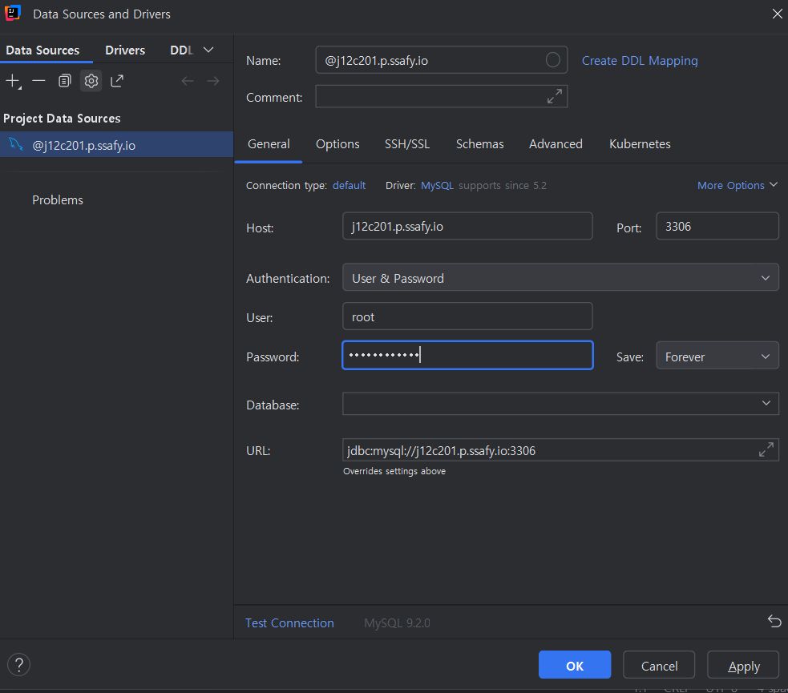

# mysql 서버 가동시키기

## EC2 서버에서 mysql 이미지 다운로드 후 mysql 컨테이너 실행

```
$ docker pull mysql:latest
$ docker run -d --name mysql -p 3306:3306 -e MYSQL_ROOT_PASSWORD=ghkdcldns201 mysql:latest
```

## mysql 컨테이너에 bash 쉘로 접속
```
$ docker exec -it mysql-container bash
```
## 이제 컨테이너 쉘에서 mysql에 접속
```
$ mysql -u root -p
Enter password: # 컨테이너 생성 시 입력했던 패스워드 입력
...
mysql>
```
이러면 컨테이너 내에서 mysql 명령어 실행이 가능해진다.

## mysql 외부 연결을 위한 EC2 서버 3306 포트 열어주기. 

포트 상태 확인
```
$ sudo ufw status
```
3306 포트 오픈
```
$ sudo ufw allow 3306
```
포트 상태 확인
```
$ sudo ufw status
Status: active

To                         Action      From
--                         ------      ----
22                         ALLOW       Anywhere
44                         ALLOW       Anywhere
8989                       ALLOW       Anywhere
8080/tcp                   ALLOW       Anywhere
3306                       ALLOW       Anywhere
22 (v6)                    ALLOW       Anywhere (v6)
8989 (v6)                  ALLOW       Anywhere (v6)
8080/tcp (v6)              ALLOW       Anywhere (v6)
3306 (v6)                  ALLOW       Anywhere (v6)
```

## intellij 에서 원격 mysql 데이터베이스에 연결하는 법

다음과 같이 입력한다.
### host : j12c201.p.ssafy.io
### port : 3306
### user : root
### password : ghkdcldns201



### 👍

# redis 서버 가동시키기 

```
$ docker pull redis:latest
$ docker run -d --name redis -p 6379:6379 redis:latest
```

## redis 접속하기

mysql 과 마찬가지다.
```
sudo docker exec -it redis redis-cli
```
redis 사용하기

```
# Redis에 데이터 넣기
$ set mykey "Hello Redis"

# Redis에서 데이터 조회하기
$ get mykey
```

## Java 예시 (Jedis 라이브러리 사용)
```java
import redis.clients.jedis.Jedis;

public class RedisExample {
    public static void main(String[] args) {
        // EC2 퍼블릭 IP와 Redis 포트 (6379)
        String redisHost = "EC2_PUBLIC_IP";
        int redisPort = 6379;

        // Redis 연결
        Jedis jedis = new Jedis(redisHost, redisPort);
        
        // Redis 명령어 실행
        jedis.set("mykey", "Hello from EC2!");
        System.out.println(jedis.get("mykey"));
        
        // 연결 종료
        jedis.close();
    }
}
```


# flutter로 Google map 앱 화면에 띄우기

## Google Maps Platform 에서 API KEY 발급받기

https://developers.google.com/maps/flutter-package/config?hl=ko&_gl=1*tftem6*_up*MQ..*_ga*MTU1NTI1NjQ3OS4xNzQyODYzNzM1*_ga_NRWSTWS78N*MTc0Mjg2MzczNC4xLjEuMTc0Mjg2Mzc1OS4wLjAuMA..#android_1

pubspec.yaml 파일에 flutter 패키지 추가 

```
dependencies:
  google_maps_flutter: ^2.11.0
```

다음 명령어 실행
```
flutter pub get
```


thewater\android\app\src\main\AndroidManifest.xml 파일의 application 태그 안에 다음과 같이 추가. 

MY_GOOGLE_MAP_API_KEY 부분을 본인이 발급받은 실제 API KEY 로 대체

```
        <meta-data
            android:name="com.google.android.geo.API_KEY"
            android:value="MY_GOOGLE_MAP_API_KEY" />

```

# API 를 안전하게 관리하기 

일단 나중에 지금 할게 많다


