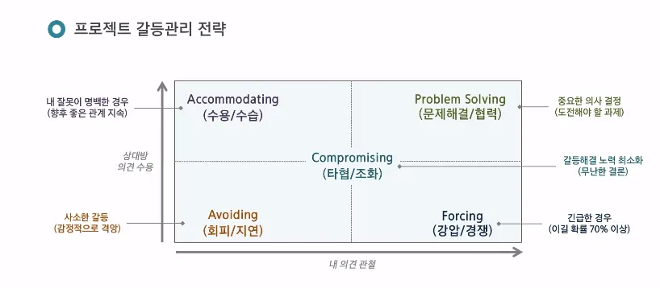

# March
 

## 3월 4일 🚩

🎯특화 프로젝트의 시작
- 팀미팅 신청은 컨설턴트님께 개인 MM 드리기
- (이번주) 기획 아이디어 (MVP) 개발에 착수할 수 있을 정도
- 데일리 스크럼 진행하기
    - 지금까지 진행할 일, 앞으로 할 일, 장애물
    - 어제 한 일, 오늘 할 일, 장애물
    - 끼어들지말기, 비난하지 말기, 잘들어주기
    - 그자리에서 해결책 찾지 말기
    - Task 진척도에만 집중하지 말기!
    - 제한 시간 없이 말하지 말기 - 시간 제한 두기
    - speaking ball - 공을 가진 사람만이 발언권을 가진다.
- Jira 협업 시작하기 - 협업 방식은 자율
- 개인별 TIL(Today I learned)
    - 팀 레포에 TIL 폴더를 만들고, 개인별 TIL.md를 만들어서 기록
- 개발환경 셋업
    - git, 협업 방식, 스프린트 단위
    - repository 관리 시작
- 상호평가 준비
- (이번주)question card 나눠주고 speaking ball로 질의응답 진행

 

🎯AI시대의 Project Management

상황에 따라 갈등 관리 전략을 선택해야 한다.

- best: 1
- worst: 2
- last: 5

각 전략 선택 상황
- emergency: 2
    - 안전과 관련된 사안
- important: 5
    - 이해 관계자
- non-important & angry person & testing: 3
    - 감정이 격앙된 사람이 있는 판단은 미루기
- my fault: 4
    - 일정 누락, 역할 분담 오류
    - 몸빵하기
- last one: 5
    - 이거저거 하기 싫을 때

>💡처음부터 완벽한 계획 x

갈등 관리

- 팀 구성원 갈등 다룰 때 가치나 결과에 대한 언급보다 감정을 다루는 것이 우선이다.
- 팀원들과  1:1로 좋은 감정 가져가기
- 롤플레잉
    - 정답
        - C || B
        - D
            - 비공식 보고서라면 A
            - 한 명씩 찾아가며 팀장이 미팅 진행
        - 팀장 갈등 이슈 대응 - 팀원 한 명 한 명 다 찾아가서 이야기해보기
            - 팀회의 전에 갈등을 빚은 장본인을 미리 찾아가서 말하기
- 경험담
    - GOOD: 팀원 의견을 하나 하나 들어 적절한 결론을 도출했던 팀장
    - BAD: 독단적인 팀장 (책임 의식 없던 팀장)

    >모든 팀원들이 책임의식을 가지고 개발을 진행할 수 있도록 적절히 동기부여를 해줄 수 있는 팀장

 
 
 
 

## 3월 5일 🚩

🎯프로젝트 아이데이션
- Charming point
    - 사용자들이 갖고싶게 만드는 지점
    - 하고 싶을걸 잘하게
- Pain point
    - 사용자가 괴로워하는 지점
    - 하기 싫은 걸 대신

- 문제를 어떻게 해결할것인가?
    - 적정 기술
    - 컨텐츠로 해결하는 것은 우리가 관심있는 것은 아니다..(지양)
        - 교육 컨텐츠 프로젝트
        - 사용자가 내용을 채워줘야하는 서비스…
- 스토리 라인을 꼭 뽑아내기
    
    > 📌 문제 x를 해결하기에 가장 적절한 기술이 이것이었습니다.
        
    - 이 문제가 왜 해결되어야하는가?
    - 이 기술이 왜 문제에 효과적인가?
        - 다른 방법은 없었나? 기존 방법보다 뛰어난가?

 
 
 
 
    
## 3월 6일 🚩

🎯Give and Take
- 사람은 세 종류가 있다
    - Giver
    - Matcher
    - Taker

> "진심으로 타인을 돕는 동시에 자신의 목표와 성장도 포기하지 않는다."
- 피드백과 도움을 잘받기
- 네트워크를 잘 쌓기
- 지나치게 베풀고, 타인 요구에 많은 에너지를 쏟으면 번아웃이 올 수 있다.

> " 타인을 돕는 만큼 나도 돌보자!"

 
 
 
 

## 3월 7일 🚩

🎯생산성 향상 기법  
  
- 업무 우선순위 선정

    - 아이젠하워 매드릭스
    - 중요한 일과 급한 일을 나누어 우선순위를 정한다.

    GTD (Getting Things Done)
    - 주어진 일을 모아 세부적인 할 일로 나누어 언제 어디서 수행할지 계획하여 일한다.

    만다라트
    - 가운데 최종목표가 있고
    - 최종목표를 이루기 위해 필요한 서브 테스크 만들기
    - 서브테스크 달성을 위한 또 다른 서브 테스크 만들기

    뽀모도로
    - 중요도 순 작업목록 만들기
    - 25분 타이머 맞추기
    - 타이머 울리기 전까지 공부
    - 타이머 울리면 5분 휴식

    타임박싱
    - 일정 시간 내 특정 작업 끝내겠다 목표를 세우는 것

    Time block
    - 하루를 블럭 단위로 나누어 생각하는 것

    Focus Time
    - 타임 블럭의 응용
    - 방해 없이 단 하나의 테스크만 집중하는 시간

- 정보정리

    - PARA Method (Project Area Resource Archive)
      - 정보를 네가지로 분류하여 정리
          - Project: 데드라인이 있는 output이 있는 일
          - Area: 내 삶과 일에서 가장 중요하고 관심사가 높은 것들
          - Resource: 특정 주제나 정보에 대한 지식
          - Archive: 현재는 주요 관심사가 아는 것들

🎯AI시대의 Project Management

어떤 프로젝트 팀이 월등한 성과를 이루는가?

- ~~팀워크와 업무성과는 상관관계가 없다.~~
    - 전통적인 팀워크
- 필요한 것들
    - 구조 및 명확성: 분명한 목표와 역할
    - 상호 의존성: 서로 역량을 신뢰할 수 있는 구성원 선말
    - 일의 의미: 자신의 일에 대하여 개인적인 의미를 부여
    - 일의 영향: 프로젝트가 중요하고 변화를 만드는 것이라는 믿음
    - 심리적 안전감: 약점을 공개해도 불이익 받지 않는 팀 분위기
- 심리적 안전감
    - 구성원 존중에서 시작
    - 내가 실력이 안 좋아도 보다 솔직히 말할 수 있는 분위기
    - 아이디어를 핀잔 주지 않는 분위기
    - 심리적 안전감 ≠ 심리적 안정감
        - 심리적 안전감은 약점 || 실패를 함께 포용하는 팀분위기
        - 심리적 안정감은 친절함과 편안함에서 오는 개인의 심리
        - >융복합시대, 프로젝트 팀 리더는 심리적 안전감을 설계해야한다.
            - 어느정도 긴장감, 비평 및 수용이 필요하다.
    - 함께 무언가 만들고자 할 때 좋은 성과를 이룰 수 있다.
    - 나는 팀장으로 심리적 안전감을 실천할 것인가
        - 팀원들이 각자의 의견을 표출하고 피드백을 제공, 수용 할 수 있도록 편안한 분위기를  만들기
            - 팀장의 표정, 말 한마디가 중요하다
            - 팀장이 긍정적인 언어를 쓰는지, 부정적인 언어를 쓰는지에 따라 성과가 크게 차이난다.
        - 긍정적 언어로 피드백하기
        - 팀원들과 같이 고민하기
        - 서로 비판을 하지 않는다는 것이 좋은것만은 아니다. (비난이 되면 안되지만 비판은 있어야한다.)
        - 참여하지 않는 팀원을 회의에 참여할 수 있도록 만들기
        - 팀장은 마음가짐이 중요하다
            - 긍정적인 마음, 수용적인 마음.
- 마무리
    - 심리적 안전감 → 구성원 존중에서 시작
    - 강력한 동조자를 확보하라
    - 1:1대화 → Group Meeting
    - Sprint → 단기적 집단적 몰입(공간&시간 확보)
    - 계속 비협조적인 팀원은 영향력을 축소하라~!

 
 
 
 
    
## 3월 10일 🚩

🎯Jira
- 번다운 차트
  - 개발 과정을 한 눈에 확인
  - 이상적인 번다운차트
      - 이상적인 우하향 그래프
- 우리 팀의 Jira 전략
    1. 한 주 목표 Sprint(1주 단위) 명확히 명시하고 완수하기
    2. 스토리는 구현하는 기능 단위로 작성
    3. 스토리포인트는 테스크에 부여하기
        - 스토리의 스토리포인트는 하위 태스크 스토리포인트의 합
        - 스토리 포인트 점수 산정
            - 1시간당 1점 (초기 최대 5점까지 예측 가능)
            - 초과시간 +1점까지 가능
    
    +구현 완료한 태스크는 오후 스크럼 이전 꼭! 완료버튼 누르기

 
 
 
 
    
## 3월 11일 🚩

🎯Jira 제대로 사용하기
- Workflow: 이슈 생성 부터 완료까지 거치는 단계외 프로세스 (Status)
  - 이슈 상태 확인
  - 진행률 파악
  - 병목 구간 식별
  - 배포 가능 여부 판단
  - workflow 디자인
      - TO DO
      - DONE
      - IN PROGRESS
- Widget
  - Dashboard 디자인 가능
  - rich filter
- Release
  - 체계적인 배포
  - 버전 관리
  - 릴리즈 노트 생성

 
 
 
 
    
## 3월 12일 🚩

🎯애자일
- 스토리포인트
    - 스토리포인트는 일정 약속이 아니다.
    - 스토리 포커
- 스프린트
    - 백로그는 웬만하면 바꾸지 말기
    - 어쩔 수 없이 바꿔야하면 다같이 논의 후 바꾸기
- 데일리 스크럼
    - 일일 보고가 아니다.
    - 서로에 관심을 가지고 어떤 것을 도와줄 수 있을지 ACTION ITEM을 만들기
- Bus Factor 높게 유지
    - 한 명이 빠져도 다른 사람이 할 수 있도록
- 칸반
    - 누구나 업무 상황 판단할 수 있는 간판 사용
    - 스크럼은 제약사항이 많은 반면 칸반은 자유롭다.
    
🎯배포
- 구글 플레이에 앱을 등록할 때, 앱 검토에는 최대 7일이 걸릴 수 있다. 따라서 다음주까지 완성되는 1차 MVP 기반으로 플레이 스토어에 앱 배포 진행해보고 반려당하면 수정 보완해서 2차 MVP 기반으로 플레이 스토어에 앱 배포 진행
    - 1차 배포 시도: 03.15
    - 2차 배포 시도: 03.22
  
 
 
 
 
    
## 3월 13일 🚩
🎯프로젝트와 기술 포폴
- 문답법과 면접
    - 면접관이 포폴 볼 때도 마찬가지
        - 왜 이 기술을 썼죠?
        - 왜 이 기술이 좋죠?
        - 왜 이기술이 빠르죠?
        - 왜 A하면 빠르죠?
    - 어떤 기술을 쓸 때 당위성이 있어야한다.
- 포폴 관련 질문
    - 프로젝트가 많아야 할까요?
        - 여러 프로젝트가 준비되어 있으면 좋을 수도 있다.
            - 그 팀의 JD에 딱 맞는 포트폴리오를 제출할 수 있어서.
                - 도메인측면, 기술스택 측면
    - 프로젝트가 화려해야할까요?
        - 네니오?
            - 공채라면, 서류에서 필터링 안되는게 중요할지도.
            - 팀별 모집이라면, 그 팀에 맞는 기술 스택 혹은 비슷한 경험이 중요
                - Base가 되는 포폴을 두고 지원할때마다 지원하는 팀에 맞게 조금씩 튜닝하기
        - 적정선을 잘 정해야한다.
            - 엘리베이터 스피치 해야한다. 30초안에 프로젝트를 설명할 수 있어야한다.
  
 
 
 
 
    
## 3월 14일 🚩

🎯Hugging Face
- 공유
  - 사전학습된 모델
  - 데이터셋
  - 코드
- 라이브러리
    - 모델, 데이터 사용
    - 학습, 파인튜닝
    - 최적화, 평가
- 인프라
    - 클라우드 배포
    - api 엔드포인트
    - 트레이닝

- 데이터 맛집
    - https://m.site.naver.com/1cSel

🎯첫직장
- 첫 직장은 생각보다 더 중요하다.
  - 초년생 때 겪는 일들이 회사에 대한 평생 가치관에 영향을 미친다.

  - 전통적인 기업, 서비스 기업
      - 전통적인 기업
          - 전통적인 기업은 워하는 인재상이 뚜렷하다
          - 전통적 기업은 전사적 프로세스가 잘 정립
      - IT 서비스 기업
          - IT 서비스기업은 인재상보단 기본기을 원한다.
          - 유연함을 추구

  - 나는 어떤 사람인가?를 생각해보며 취준하기

  - 첫 회사로 큰 회사를 가면 좋다.
    
 
 
 
 
    
## 3월 17일 🚩
  
🎯기술 업계의 Toxic 말투

- 기술업계에서는 Fact를 말하는걸 중요하게 여긴다.
    - 다만, 상대방을 상처주는 방식으로 말하는 사람이 많다.
    
- 팩트는 팩트인가?
    - 자유의지는 존재할까?
        - 사람의 자유의지, 의지는 무의식의 영향이 먼저일 수 있다.
        - 생각과 판단은 합리화일 수도 있다.
        - 무의식이 결정하고 의식이 합리화한다
        - 강하게 말해야하는 것은 지양해야할 수도 있다.
    - 팩트라 생각하고, 팩트가 아닌 것이 있을 수 있다.
        - 당신은 X를 이해하지 못한다. ⇒ 이건 단순 의견일 뿐! 팩트가 아니다
        - 그 사람에 도움되는 것이 아니면 굳이 의견을 말할 필요가 없다.

- 팩트는 아파야하는가?
    - 건설적으로 피드백을 줘도 아플 수 있다.
    - 좀더 노력한다면, 안/덜 아프게 이야기하는 것이 있을 수 있다.
    - 나중심 화법
        - ex. 나는 전체 일정이 늦춰질까 걱정이돼.
    - 공통의 목표를 환기
        - ex. 우리팀이 X 하고 싶단걸 생각했을 때, 이렇게 하는게 더 좋겠어.
    - 상대방의 입장 확인하기
        - ex. ~한 상황으로 이렇게 한 것 같은데, 이렇게 하는게 더 좋겠어
            - 상대방의 상황을 이해해주기

- 버려야하는 것
    - 사무적, 기계적으로 말하는 것 ⇒ 유대감이 사라진다.
        - 상대방의 감정을 배려한 말투를 쓰자.
            - 상대가 잘한 부분을 말해주기.
    - 습관적인 비관
        - 비관적인 경험이 너무 많아 다 안될거라는 사람
        - 지난번엔 이런 점 때문에 실패했던 것 같다. 그 점을 이렇게 보완하면 될 것 같다. 와 같은 방식으로 보다 건설적인 대화를 진행하기
    - 거들먹, 빈정거림
        - ex. 공부 참 많이 하셨네요 그 논의가 나온 배경은 제가 n년 전 한창 ~할 때 나온건데요.
            - 상대방의 노력을 뭉뚱그려 무시
    - 수동적 공격성
        - (치졸한것)적개심, 불만을 품은 대상을 미묘하고 간접적인 방식으로 불편하거나 혼란스럽게 만드는 것
        - ex.이번에는 준비 많이 했나봐 지난번에는 엉망이더니~
  
 
 
 
 
    
## 3월 13일 🚩
🎯spring boot 학습1
### 파일구조

- application properties: DB연결 경로 등 지정
- test
    - class를 test해보는 test 코드
    - 내가 원하는 로직대로 동작하는지 확인
- pom.xml
    - maven 사용시 사용되는 pom 파일
    - <parent> 폼 파일 상단 폼파일 정의
        - dependency 상속
    - <dependencies>
        - 우리가 사용할 open api
    - <build>
        - 플러그인
        

### Maven과 Gradle

자바 build 관리 도구

- 프로젝트 파일 자동 인식하여 빌드
- 소스코드 컴파일, 테스트, 정적 분석 등
- 외부 라이브러리 참조 자동 다운 및 업데이트 관리

- maven
    - pom 파일로 외부 라이브러리 관리
    - xml 기반 빌드 스크립트
    - 라이프사이클(빌드) 도입

- gradle
    - 안드로이드 표준 빌드 시스템
    - 빠른 처리속도
    - 간결한 구성
    - 용어
        - repositories: 참조할 라이브러리, 라이브러리가 저장된 위치 설정
            - mavenCentral: 기본 Maven Repository
        - dependencies: 라이브러리 사요을 위한 의존성

### rest api

- rest 특징
    - server-client구조
    - stateless
    - cacheable
    - 계층화
    - code on demand(optional)
    - 인터페이스 일관성
- 장점
    - http 표준 프로토콜 사용하는 모든 플랫폼 호환 가능
    - 서버 클라이언트 역할 명확히 분리
    - 여러 서비스 생길 수 있는 문제 최소화
- rest api
    - rest 아키텍처 조건 준수하는 어플리케이션 프로그래밍 인터페이스
    - rest 아키텍처를 구현하는 웹 서비스를 restful하다고 표현
- 설계 규칙
    - uri를 통해 자원 표현
    - 자원 조작은 CRUD(http method)를 통해 표현
    - 메세지를 통한 리소스 조작
        - html, xml, json, text가 있음
    - 소문자 사용
    - -쓰기 _쓰지말기
    - 파일확장자 표현하지 말기

### pom.xml

- 프로젝트 기본 정보
    - <name>: 프로젝트 명
    - <url>: 프로젝트 사이트 url
    - <description>: 프로젝트에 대한 간단한 설명
    - <organization>: 프로젝트 관리하는 단체 설명
- 프로젝트 연관 정보
    - <groupIId>: 프로젝트 그룹 아이디
    - <artifactId>: 프로젝트 아티팩트 아이디
    - <version>: 프로젝트 버전
    - <package>: 패키징 타입
        - jar: 자바 프로젝트 압축 파일
        - war: 웹 어프리케이션 패키징
- 프로젝트 의존 설정
    - <dependencies>: 라이브러리 의존성 정보를 가지고 있는 dependency태그를 ㅂㅂㅁ묶은 태그
    - <dependency>: 각 라이브러리의 정보 담는 태그
    - <groupId>: 의존성 라이브러리의 그룹아이디
    - <artifactId>: 의존성 라이브러리의 아티팩트 아이디
    - <version>: 의존성 라이브러리의 버전
    - <scope>: 해당 라이브러리의 이용 범위를 지정
        - compile: 기본값, 모든 클래스 경로에서 dependency 사용 가능. 컴파일 배포 상황에 같이 제공
        - provided: jdk, container 런타임시에만 제공. 배포시 빠짐
        - runtime: 컴파일시사용하지 않고 실행상황에서만 사용
        - test: 테스트 상황에만 사용. 실상황에서 안씀
        - system: provided와 유사하나, 저장소에서 관리되지 않고 직접 관리하는 jar 추가. system path 추가
    - <optional>: 다른 프로젝트에서 이 프로젝트를 의존성 설정을 할 경우 같이 따라가서 의존성 사용할지 결정

### 라이브러리 설명

- spring boot starter parent
    - 프로젝트 사용 다양한 라이브러리간 버전 충돌 방지
- spring boot starter web
    - spring mvc를 사용한 rest 서비스 개발시 사용
- spring boot starter test
    - junit, hamcrest, mockito를 포함한 스프링 어플리케이션 테스트 기능 제공

- lombok: annotation 대체

### MVC 패턴

- 디자인 패턴 중 하나
- model, view, controller
- 어플리케이션 구성시 그 구성요소 세가지의 역할로 구분한 패턴
- 모든 사용자요청: controller
    - 모델과 뷰 사이 브릿지
    - 사용자 입력에 대한 응답으로 모델 및 뷰를 업데이트
    - 컨트롤러로 들어온 요청은 어떻게 처리할지 결정해 모델로 요청 전달
- 데이터베이스 처리: model
    - 데이터 처리
    - DAO(Data Access Object)및 DO(Data Object)로 구성됨
- 업데이트: view
    - 데이터 보여주는 화면 영역
    - UI
    - 데이터를 각 요소에 배치
    - 별도 데이터 보관하지 않고 처리만함
- 특징
    - 서로간 의존성이 낮아짐
    - 각 영역이 독립적으로 구성되어 분업, 협업 원활
    - 한 영역 업데이트 하더라도 다른 곳에 영향을 주지 않음
- 단점
    - controller 역할 과중

### Hello World

- RestController
    - 어노테이션
    - view를 거치지 않고 http response body에 직접 return값을 담아 보냄
- RequestMapping
    - RequestMapping을 통해 url 매핑해 경로 설정, 해당 메소드에서 처리
    - 대표
    - value: url 설정
    - method: GET, POST, DELETE, PUT, PATCH 등
    - 메소드보다 간단히 어노테이션 사용
        - @GetMapping
        - @PostMapping
        - …