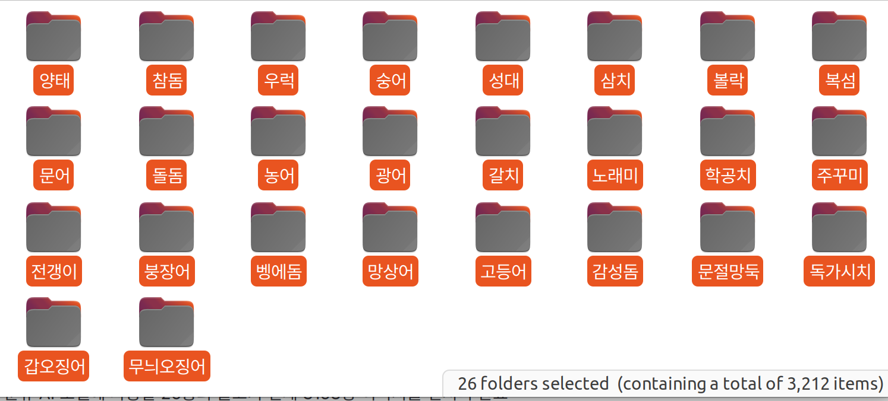

TIL (Today I Learned) - 2025-03-14

🐟 물고기 분류 모델 데이터 전처리

✅ 오늘 한 일

물고기 분류 AI 모델에 사용할 26종의 물고기 전체 3163장 이미지를 전처리 완료

주요 전처리 과정:

이미지 리사이징: 모델 학습에 적합한 크기로 조정.

노이즈 제거: 불필요한 배경 요소 제거.

부족한 이미지 네이버 이미지 찾아서 추가

✅ 다음 주 할 일 

ai 물고기 분류 모델 생성 및 테스트

