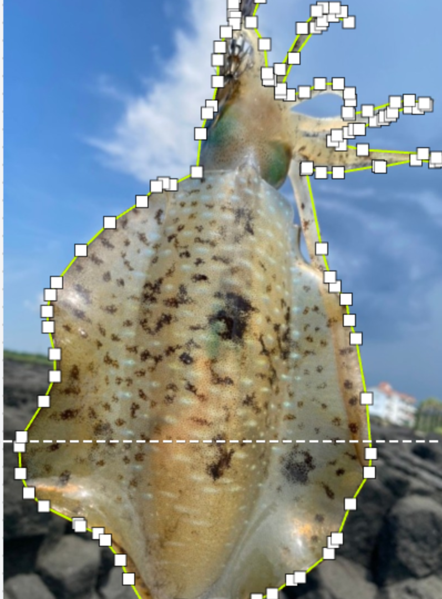

# 📝 TIL (Today I Learned) - Ubuntu & 물고기 길이 측정

## ✅ Ubuntu Conda & CUDA 세팅
오늘 Ubuntu 환경에서 **Conda 및 CUDA**를 설정 완료!  
이제 물고기 길이 측정 모델을 개발하기 위해 여러 방법을 조사했다.

---

## 🎯 기준 물체 없이 물고기 길이 측정하는 방법

### 1️⃣ **AI 기반 단일 이미지 길이 측정**
기준 물체 없이 물고기 길이를 측정하려면 **AI 기반 깊이(Depth) 추정**이 필요하다.

#### ✅ **방법**
- AI가 사진 속 물고기 위치와 모양을 인식하고, **깊이 정보를 예측**하여 길이를 계산
- 사람이 물고기를 **손에 들거나 평평한 표면에 놓고 촬영**하면 더 정확한 결과 가능

#### 📌 **적용 가능한 기술**
| 기술 | 설명 |
|------|------|
| **MiDaS (MonoDepth)** | 단일 이미지에서 깊이를 추정하는 최신 AI 모델 |
| **YOLO + 크기 예측 모델** | YOLO로 물고기 탐지 후 크기 예측 모델로 길이 계산 |

---

### 2️⃣ **영상(비디오) 기반 길이 측정**
단일 이미지 대신 **영상 촬영**을 활용하면 더 정확한 길이 측정 가능

#### ✅ **방법**
1. 스마트폰으로 물고기를 **2~3초간 촬영**
2. AI가 물고기 모양을 **추적하며 거리와 크기를 계산**
3. 시점 변화(Parallax)를 활용하여 **3D 정보 생성**

#### 📌 **적용 가능한 기술**
| 기술 | 설명 |
|------|------|
| **SfM (Structure from Motion)** | 여러 프레임을 분석하여 3D 정보 생성 |
| **NeRF (Neural Radiance Fields)** | 2D 이미지를 학습하여 3D 모델 생성 |
| **DeepLabCut (포즈 추적)** | 물고기 머리-꼬리 포인트 검출 후 길이 측정 |

---

## 🎯 최종 선정한 방법 (고성능 GPU 필요 기술 제외)

### ✅ **스마트폰 기반 길이 측정 모델**
1. **YOLOv8** → 물고기 인식 & 윤곽 감지
2. **DeepLabCut** → 머리-꼬리 검출 & 길이 측정
3. **OpenCV 거리 변환** → 픽셀 값을 실제 길이(cm)로 변환

| 기능 | 추천 기술 | 이유 |
|------|---------|-----|
| 물고기 인식 & 윤곽 추출 | YOLOv8 + DeepLabV3 | 정확한 물고기 윤곽 감지 |
| 머리-꼬리 검출 & 길이 측정 | DeepLabCut | AI가 자동으로 포인트 검출 |
| 길이 변환 (픽셀 → cm) | OpenCV 거리 보정 | 스마트폰 카메라 거리 활용 |

### 📌 **구현 과정**
1️⃣ 스마트폰으로 물고기 촬영  
2️⃣ **YOLOv8**이 물고기를 탐지하고 윤곽 감지  
3️⃣ **DeepLabCut**이 머리-꼬리 포인트 검출  
4️⃣ 픽셀 길이를 **실제 길이(cm)** 로 변환  

📌 **길이 변환 공식**
실제_길이(cm) = (픽셀_길이 × 실제_거리) / 카메라_초점_길이
카메라 거리(Depth)는 ARKit / ARCore로 측정 가능
일반 스마트폰에서도 거리 측정 가능

🏗️ 다음 할 일

📌 물고기 데이터 라벨링 진행 중
📌 YOLOv8 + DeepLabCut 기반 길이 측정 모델 개발

