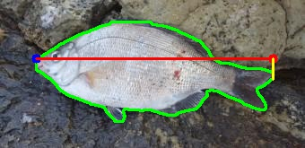
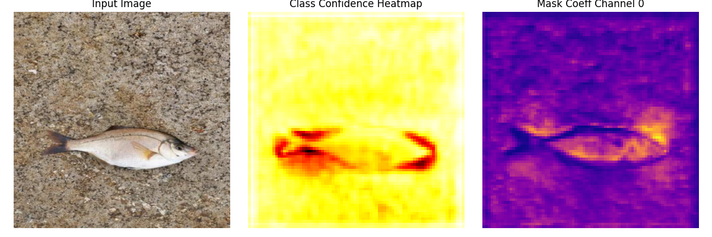
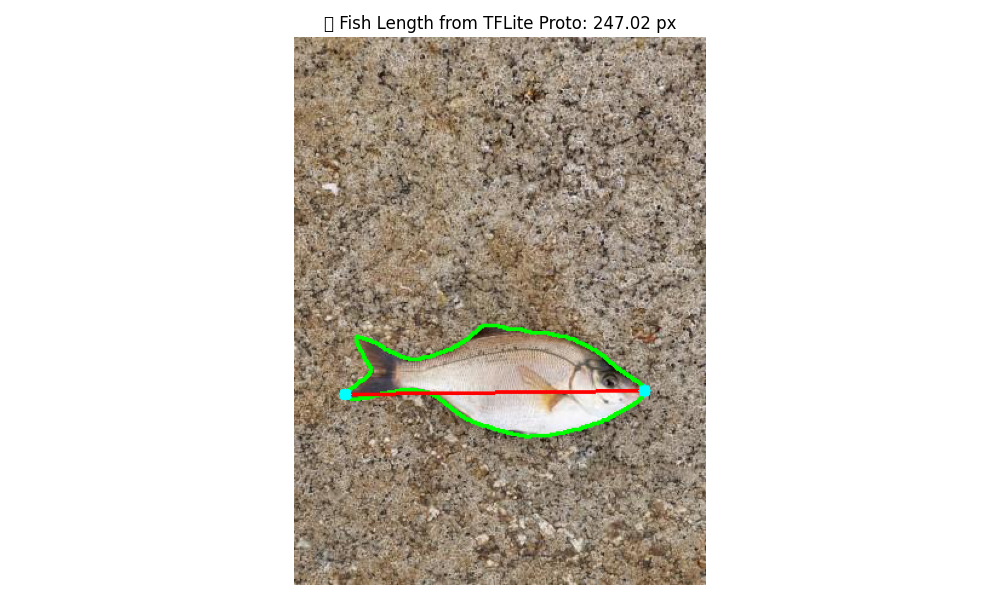
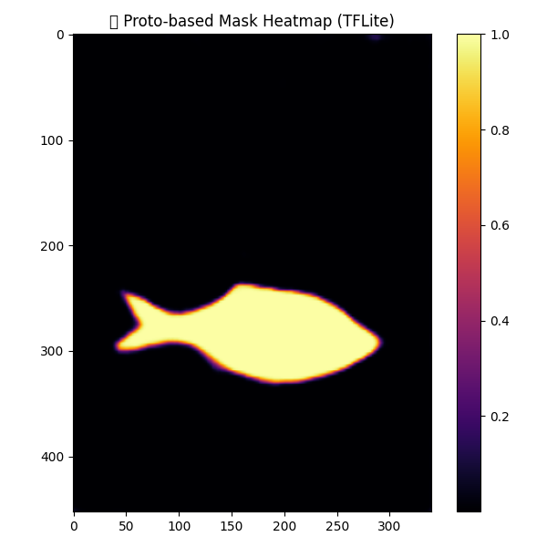
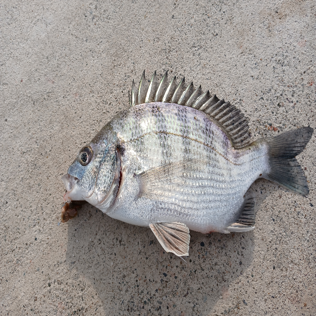
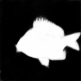
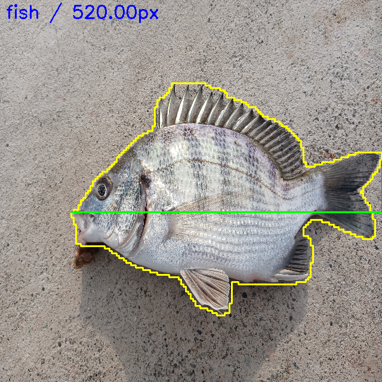

# 📝 TIL: (Today I Learned) (2025-03-04 ~ 2025-03-06)
https://www.notion.so/1ae6458fd4ee805f91f2e4986a043956 진행과정 노션
## 🔹 오늘 한 일

### 1️⃣ 환경 설정
- Python **3.8** 설치
- 필요한 라이브러리 설치 (예: `requests`, `BeautifulSoup`, `selenium`, `opencv` 등)

### 2️⃣ 크롤링 초기 작업
- 물고기 종류 **26종** 설정
- 크롤링 코드 작성 요청 (GPT 활용)
- 크롤링 코드 실행 중 **에러 발생** → 코드 수정
- 수정 후 **또 다른 에러 발생** → 추가 수정 진행
- 관련 에러 노션 기록

### 3️⃣ 이미지 수집 개선
- 수집한 이미지 상태가 **불량**하여 개선 작업 수행
- **설정 변경**:
  - 물고기 26종, **100장씩**, **10번 스크롤** → 수집량 증가 필요
  - 물고기 26종, **300장씩**, **10번 스크롤**, **낚시 관련 키워드 추가**
  - 키워드별 검색 진행
  - **이미지 URL을 따로 저장**하여 중복 다운로드 방지

### 4️⃣ 크롤링 안정화
- **무차별 수집 방지 기능 추가** (네트워크 차단 방지)
- `opencv` 설치 및 적용
- **구글 대신 네이버 검색 사용**으로 전환
- 필터링 적용하여 **불량 이미지 제거**

### 5️⃣ 최종 실행
- 물고기 **26종, 300장씩** 크롤링 완료 🎉

---

## 🔹 배운 점
- 크롤링할 때 **반복적인 에러 수정이 필요**하며, 예외 처리를 철저히 해야 함
- 이미지 크롤링 시 **중복 다운로드 방지**가 중요함
- 구글과 네이버 검색의 차이점을 이해하고 적절한 검색 엔진을 선택하는 것이 필요함
- 필터링을 통해 **불량 이미지 제거**를 자동화하는 것이 품질을 높이는 핵심

---


//

# 📝 TIL (Today I Learned) - 2025-03-07

🚀 오늘 진행한 과정 요약

1️⃣ 데이터 수집 (크롤링)
네이버 이미지 크롤러를 사용하여 감성돔, 갑오징어, 갈치 세 종류의 물고기 이미지를 수집
크롤링한 이미지 중 광고, 사람이 포함된 사진 등의 잘못된 이미지 필터링 시도
OpenCV + OCR(pytesseract)을 활용하여 텍스트 포함된 이미지 제거

2️⃣ 데이터 정리 & 전처리
dataset/ 디렉토리 구조 정리
train, val, test 폴더로 데이터셋 분리
PyTorch ImageFolder를 사용하여 자동으로 데이터 불러오기

3️⃣ 모델 학습 (VGG16)
torchvision.models.vgg16(pretrained=True)를 사용하여 사전 학습된 VGG16 모델 로드
모델의 Fully Connected Layer(classifier[6])를 **3개 클래스(감성돔, 갑오징어, 갈치)**로 수정
데이터 증강(Augmentation) 적용 (RandomHorizontalFlip, RandomRotation)
Adam Optimizer 사용하여 10 Epoch 학습 진행
최종 학습된 모델(fish_classifier.pth) 저장

4️⃣ 모델 테스트 & 예측
fish_test.py에서 저장된 모델을 로드
학습한 모델과 동일한 이미지 전처리 적용 후 테스트 이미지(fish1.jpg)로 예측
model.load_state_dict(torch.load(...)) 시 클래스 개수 불일치 문제 발생 → num_classes = 3으로 수정
CUDA unknown error 발생 → Docker 내에서 GPU 접근 문제로 확인됨
죄다 갑오징어로 분류함. 학습 잘못 됨.

5️⃣ Docker 환경 문제 해결
기존 Docker 컨테이너에 Python 버전 다운그레이드(3.8) 시도했으나 패키지 미지원
docker exec -it -u root 컨테이너명 bash로 컨테이너 내부 진입 후 CUDA 및 PyTorch 환경 확인
nvidia-smi로 GPU 사용 가능 여부 체크
nvcc -V 명령어 실행 불가 → CUDA 관련 패키지 누락 문제 해결 필요

//

# 📝 TIL (Today I Learned) - 2025-03-10

## 🐟 물고기 분류 모델 데이터 전처리

### ✅ 오늘 한 일
- **물고기 분류 AI 모델**에 사용할 26종의 물고기 중 **7종의 물고기 이미지**를 전처리함.
- 주요 전처리 과정:
  - **이미지 리사이징**: 모델 학습에 적합한 크기로 조정.
  - **노이즈 제거**: 불필요한 배경 요소 제거.


### 🔥 내일 할 일
- 국방의 의무


//

# 📝 TIL (Today I Learned) - 2025-03-12

🐟 물고기 분류 모델 데이터 전처리

✅ 오늘 한 일


물고기 분류 AI 모델에 사용할 26종의 물고기 중 2종(망상어, 독가시치의 물고기 이미지를 전처리함.
주요 전처리 과정:


이미지 리사이징: 모델 학습에 적합한 크기로 조정.

노이즈 제거: 불필요한 배경 요소 제거.

부족한 이미지 네이버 이미지 찾아서 추가


//

# 📝 TIL (Today I Learned) - 2025-03-13

🐟 물고기 분류 모델 데이터 전처리

✅ 오늘 한 일


물고기 분류 AI 모델에 사용할 26종의 물고기 중 11종(무늬오징어, 문절망둑, 볼락, 붕장어, 학공치, 국건도움-돌돔, 우럭, 참돔, 복섬, 주하도움-주꾸미, 재민도움-양태)의 물고기 이미지를 전처리함.

주요 전처리 과정:


이미지 리사이징: 모델 학습에 적합한 크기로 조정.

노이즈 제거: 불필요한 배경 요소 제거.

부족한 이미지 네이버 이미지 찾아서 추가


# 📝 TIL (Today I Learned) - 2025-03-14

🐟 물고기 분류 모델 데이터 전처리

✅ 오늘 한 일

물고기 분류 AI 모델에 사용할 26종의 물고기 전체 3163장 이미지를 전처리 완료

주요 전처리 과정:

이미지 리사이징: 모델 학습에 적합한 크기로 조정.

노이즈 제거: 불필요한 배경 요소 제거.

부족한 이미지 네이버 이미지 찾아서 추가

✅ 다음 주 할 일 

ai 물고기 분류 모델 생성 및 테스트


//

# 📝 TIL (Today I Learned) - 2025-03-17

## ✅ Ubuntu Conda & CUDA 세팅
오늘 Ubuntu 환경에서 **Conda 및 CUDA**를 설정 완료!  
이제 물고기 길이 측정 모델을 개발하기 위해 여러 방법을 조사했다.

---

## 🎯 기준 물체 없이 물고기 길이 측정하는 방법

### 1️⃣ **AI 기반 단일 이미지 길이 측정**
기준 물체 없이 물고기 길이를 측정하려면 **AI 기반 깊이(Depth) 추정**이 필요하다.

#### ✅ **방법**
- AI가 사진 속 물고기 위치와 모양을 인식하고, **깊이 정보를 예측**하여 길이를 계산
- 사람이 물고기를 **손에 들거나 평평한 표면에 놓고 촬영**하면 더 정확한 결과 가능

#### 📌 **적용 가능한 기술**
| 기술 | 설명 |
|------|------|
| **MiDaS (MonoDepth)** | 단일 이미지에서 깊이를 추정하는 최신 AI 모델 |
| **YOLO + 크기 예측 모델** | YOLO로 물고기 탐지 후 크기 예측 모델로 길이 계산 |

---

### 2️⃣ **영상(비디오) 기반 길이 측정**
단일 이미지 대신 **영상 촬영**을 활용하면 더 정확한 길이 측정 가능

#### ✅ **방법**
1. 스마트폰으로 물고기를 **2~3초간 촬영**
2. AI가 물고기 모양을 **추적하며 거리와 크기를 계산**
3. 시점 변화(Parallax)를 활용하여 **3D 정보 생성**

#### 📌 **적용 가능한 기술**
| 기술 | 설명 |
|------|------|
| **SfM (Structure from Motion)** | 여러 프레임을 분석하여 3D 정보 생성 |
| **NeRF (Neural Radiance Fields)** | 2D 이미지를 학습하여 3D 모델 생성 |
| **DeepLabCut (포즈 추적)** | 물고기 머리-꼬리 포인트 검출 후 길이 측정 |

---

## 🎯 최종 선정한 방법 (고성능 GPU 필요 기술 제외)

### ✅ **스마트폰 기반 길이 측정 모델**
1. **YOLOv8** → 물고기 인식 & 윤곽 감지
2. **DeepLabCut** → 머리-꼬리 검출 & 길이 측정
3. **OpenCV 거리 변환** → 픽셀 값을 실제 길이(cm)로 변환

| 기능 | 추천 기술 | 이유 |
|------|---------|-----|
| 물고기 인식 & 윤곽 추출 | YOLOv8 + DeepLabV3 | 정확한 물고기 윤곽 감지 |
| 머리-꼬리 검출 & 길이 측정 | DeepLabCut | AI가 자동으로 포인트 검출 |
| 길이 변환 (픽셀 → cm) | OpenCV 거리 보정 | 스마트폰 카메라 거리 활용 |

### 📌 **구현 과정**
1️⃣ 스마트폰으로 물고기 촬영  
2️⃣ **YOLOv8**이 물고기를 탐지하고 윤곽 감지  
3️⃣ **DeepLabCut**이 머리-꼬리 포인트 검출  
4️⃣ 픽셀 길이를 **실제 길이(cm)** 로 변환  

📌 **길이 변환 공식**
실제_길이(cm) = (픽셀_길이 × 실제_거리) / 카메라_초점_길이
카메라 거리(Depth)는 ARKit / ARCore로 측정 가능
일반 스마트폰에서도 거리 측정 가능

🏗️ 다음 할 일

📌 물고기 데이터 라벨링 진행 중
📌 YOLOv8 + DeepLabCut 기반 길이 측정 모델 개발


//

# 📝 TIL (Today I Learned) - 2025-03-18
물고기 윤곽 및 키포인트 검출 모델 라벨링 진행

📌 1️⃣ YOLOv8 / DeepLabV3 → 물고기 윤곽 검출
이미지에서 물고기의 전체 윤곽을 인식하여 배경과 분리하는 역할
Instance Segmentation 수행
총 784장의 이미지 라벨링 완료

📌 2️⃣ DeepLabCut → 머리-꼬리 좌표 검출
물고기 머리(코 끝)와 꼬리 끝을 Keypoint Detection으로 인식
픽셀 단위로 머리~꼬리 거리 계산 가능
총 1,096장의 이미지 라벨링 진행 완료

✅ 라벨링 현황
Keypoint Detection: 1,096장
Instance Segmentation: 784장

📌 라벨링 마저 진행예정 🚀


//

# 📝 TIL (Today I Learned) - 2025-03-19
물고기 윤곽 및 키포인트 검출 모델 라벨링 진행

📌 1️⃣ YOLOv8 / DeepLabV3 → 물고기 윤곽 검출
이미지에서 물고기의 전체 윤곽을 인식하여 배경과 분리하는 역할
Instance Segmentation 수행
오늘 662장의 이미지 라벨링 완료


✅ 라벨링 현황
Keypoint Detection: 1,096장
Instance Segmentation: 1446장

📌 라벨링 마저 진행 예정 🚀


//
# 📝 TIL (Today I Learned) - 2025-03-19
발표자료 준비로 pass
# 📝 TIL (Today I Learned) - 2025-03-20
발표준비 및 발표로 pass

//

# 📝 TIL (Today I Learned) - 2025-03-24
물고기 윤곽 및 키포인트 검출 모델 라벨링 진행

📌 1️⃣ YOLOv8 / DeepLabV3 → 물고기 윤곽 검출
이미지에서 물고기의 전체 윤곽을 인식하여 배경과 분리하는 역할
Instance Segmentation 수행
오늘 1091장의 이미지 라벨링 완료


✅ 라벨링 현황
Keypoint Detection: 1,096장
Instance Segmentation: 2,537장

📌 라벨링 마저 진행 예정 🚀


//

# 📝 TIL (Today I Learned) - 2025-03-25
물고기 윤곽  검출 모델 라벨링 완료

📌 1️⃣ YOLOv8  → 물고기 윤곽 검출
이미지에서 물고기의 전체 윤곽을 인식하여 배경과 분리하는 역할
Instance Segmentation 수행
물고기 윤곽 검출 모델 테스트 성능 높음


돌돔에서만 몇 장의 이미지 윤곽검출실패 - > 돌돔만 추가로 이미지 증강, 정확도 높이는 방법 연구필요


✅ 라벨링 현황
Keypoint Detection: 1,096장
Instance Segmentation: 3,191장

📌 라벨링 마저 진행 예정 🚀
꼬리-머리 길이 측정 모델 개발

//

# 📝 TIL (Today I Learned) - 2025-03-26
물고기 윤곽  검출 모델 변환

변환 순서:
PyTorch → ONNX → TensorFlow → TFLite

변환 이유:
Flutter+ARCore 앱에서 사용하기 위해 TFLite 필요
자동 윤곽 탐지 기반 길이 측정 기능 구현 목적

💥 TFLite 변환 중 문제 발생
문제 현상:
PyTorch에서는 정상 작동


TFLite에서는 윤곽 못 찾음 (정확도 처참)


8시간 동안 구른 이유:
TFLite 정확도 낮음 → sigmoid 미적용 때문!
변환 시 내부 코드 수정 필요

📌 내일 할 일 : 길이 측정 모델 개발🚀

# 📝 TIL (Today I Learned) - 2025-03-27
물고기 윤곽  검출 모델 변환

변환 순서:
PyTorch →(이게 안됨) ##ONNX → TensorFlow → TFLite

변환 되어도 물고기를 제대로 탐지 못하고 이상한 곳에 바운딩 박스를 계속 그림.
물고기도 한마리밖에 없는데 8천마리 있다고 출력하는 등 문제가 많다. onnx에 윤곽 추출 모델이 없어서 그런다는데. 계속 원인 파악하고 모델 변환 시도 중. 
pytorch 모델은 탐지 잘 한다.



📌 내일 할 일 : 길이 측정 모델 변환🚀

//

# 📝 TIL (Today I Learned) - 2025-03-28

## 🎯 목표
YOLOv8 Instance Segmentation 모델을 TFLite로 변환하고,  
TFLite 모델만을 활용하여 **물고기 윤곽 마스크 재구성 및 자동 길이 측정**까지 완전하게 구현하는 것.

---

## ✅ 전체 진행 흐름

### 1. YOLOv8 Segmentation 모델 준비
- 라벨: Roboflow에서 instance segmentation dataset 다운로드
- 학습: 커스터마이징된 `yolov8n-seg.yaml`로 학습 완료
- 결과: `best.pt` 가중치 확보

---

### 2. PyTorch → ONNX 변환 (📌 가장 큰 이슈 발생 지점)

#### ❌ 문제
- `model.export(format="onnx")`로 변환된 모델(`best.onnx`)에서 **정확도 급감**
- 추론 결과가 모두 0에 가까운 confidence 또는 마스크가 의미 없게 나옴

#### ✅ 해결 과정
- [`Segment.forward()`] 내부 구조 수정:
  - `export=True`일 때 내부적으로 **`proto` 크기와 `cls` 크기 일치하도록 interpolate** 추가
  - 마지막 `output`을 `(cls_flat + mask)` 형태로 결합하여 ONNX export-friendly 구조로 변경

#### ✅ 정확도 복원 위한 핵심 작업
- `proto = F.interpolate(proto_out, size=cls.shape[2:], mode='bilinear')` 추가
- `sigmoid`가 export 시 누락되는 문제 해결 위해 **수동 sigmoid 적용** 고려
- `torch.onnx.export(..., input_names, output_names, dynamic_axes)` 설정 명확화
- `onnxsim`으로 단순화한 후 저장: `best_sim.onnx`



---

### 3. ONNX → TensorFlow → TFLite 변환

#### 📦 도구 사용
- [`onnx2tf`] with `--output_signature` 옵션: `onnx2tf -i best_sim.onnx -ois`
- TensorFlow SavedModel → `segment_flex.tflite`로 변환
  - `tf.lite.TFLiteConverter` 사용
  - Flex delegate 포함 (일부 dynamic op 처리)

#### ⚠️ 주의
- `sigmoid` 연산이 변환 중 누락되어 **logit 값으로 출력**됨
- 따라서 TFLite 추론 후 `sigmoid(cls_conf)` 수동 적용 필요

---

## 🧪 디버깅 실험: PyTorch vs TensorFlow vs TFLite

### PyTorch 추론 결과 저장
- `proto.npy`: shape = `(32, 160, 160)`
- `mask_vector.npy`: shape = `(32,)`
- 길이 측정, 윤곽 시각화, 마스크 히트맵 확인

### TensorFlow에서 마스크 복원 실험
- 저장된 `proto`, `mask_vector`를 활용
- `proto × mask_vector` → sigmoid → resize → binary mask
- 윤곽선 추출 후 두 점 거리 측정

### TFLite 추론 결과 실험
- `output`: shape = `(1, 6400, 34)`
- `output[:, 1]` → sigmoid(confidence)
- `output[:, 2:]` → mask vector
- top-1 vector만으로 마스크 복원 및 시각화 성공

---

## 🐛 주요 에러 및 해결 요약

| 에러/현상 | 원인 | 해결 방법 |
|-----------|------|------------|
| `IndexError: preds[1]` | Segment.forward에서 tuple 반환 안 함 | `(output, proto)` 명시적으로 반환 |
| 마스크가 항상 고정됨 | proto를 새로 추출하지 않음 | PyTorch 추론에서 매번 proto 추출 |
| TFLite confidence 모두 음수 | sigmoid 제거됨 | 수동 sigmoid 적용 |
| 마스크가 전혀 안 나옴 | proto-image 불일치 or vector 0 | 모델 추론과 일치하는 이미지로 진행 |
| TFLite에서 confidence 너무 작음 | sigmoid 미적용 | sigmoid(cls_conf) 확인 필수 |

---

## 📷 시각화 결과

| 파일명 | 설명 |
|--------|------|
| `fish_length_from_pytorch_proto.png` | PyTorch 기반 마스크 길이 측정 |
| `mask_heatmap_from_proto.png` | proto 기반 마스크 히트맵 |
| `fish_mask_overlay.png` | TFLite 추론 후 마스크 시각화 |
| `fish_length_from_tflite_proto.png` | TFLite 추론 후 길이 측정 |

---

## 🧠 오늘 배운 점

- YOLOv8에서 `Segment` 구조를 export에 맞게 수정하는 것이 중요
- TFLite 모델에서 confidence가 logit으로 출력될 수 있으므로 항상 sigmoid 확인
- 정확도 비교 실험은 proto+mask_vector 저장 방식으로 깔끔하게 검증 가능
- 변환 경로별로 마스크 정확도 및 위치 오차가 존재할 수 있으므로 디버깅용 시각화 필수
- **ONNX → TF → TFLite**는 변환 정밀도와 구조가 무너지지 않도록 export 로직을 정밀하게 맞춰야 함

---

✅ **최종 결과**:  
- PyTorch 모델을 정확하게 TFLite로 변환하고,  
- TFLite만으로 **물고기 윤곽 마스크 복원 및 길이 측정 자동화 성공!**



# 📝 TIL (Today I Learned) - 2025-03-31, 2025-04-01

🐟 YOLOv8 Instance Segmentation 기반 물고기 길이 측정 모델 변환 및 디버깅 전 과정 정리

✅ 1. 시작: PyTorch에서 완벽하게 동작하던 YOLOv8 Segment 모델
best.pt 모델은 Roboflow에서 학습된 YOLOv8 instance segmentation 모델이었고, PyTorch 추론에서는 완벽하게 작동

물고기 윤곽을 감지하고, 그 윤곽선의 가장 먼 두 점을 기준으로 거리(px)를 계산하는 것도 매우 정밀하게 수행

❗️2. ONNX 변환: Confidence가 0.0001 수준

문제
ONNX export 후 추론해보니 confidence가 0.00001 수준까지 떨어짐

원인
Segment.forward()에서 export=True일 때 단일 scale (x[0])만 사용하고 있었음.
YOLOv8은 기본적으로 3개의 feature scale에서 예측을 수행하므로 정보가 손실되고 있었음.

해결
모든 scale (x[0], x[1], x[2])에서 cls와 mask를 추출해 concat하도록 forward()를 수정.
export 모드에서도 sigmoid가 적용되지 않아 raw logits가 그대로 나가던 것을 수동으로 적용.

❗️3. Mask Vector 차원 불일치

문제
proto shape은 [32, H, W]인데, mask_vector는 [28]로 나와 곱셈이 불가능.

원인
self.nm을 32로 설정했지만, 모델 내부 구조상 mask_vector가 28차원으로 설정되어 export됨.

해결

```python
if mask_flat.shape[-1] < self.nm:
    pad_size = self.nm - mask_flat.shape[-1]
    pad = torch.zeros(mask_flat.shape[0], mask_flat.shape[1], pad_size, device=mask_flat.device)
    mask_flat = torch.cat([mask_flat, pad], dim=2)
→ 부족한 차원을 padding하여 강제로 nm 유지.
```

❗️4. 채널 mismatch: ONNX export 자체가 실패

문제
ONNX export 도중 오류 발생.
C2f, Conv, Segment 간의 channel 수가 맞지 않음.

원인
.yaml 설정의 C2f 구조와 best.pt가 서로 다르게 설정되어 있었음.
특히 Segment 입력 채널 [64, 128, 256]과 구조가 안 맞는 경우가 많았음.

해결
yaml 구조를 best.pt에 맞게 재정렬.
Segment 입력 채널을 실제 pt 모델 구조와 정확히 맞춤.

❗️5. proto 해상도 mismatch

문제
ONNX export 후 proto가 너무 작아져서 마스크가 복원되지 않음.

해결
proto를 cls[0]의 해상도에 맞춰 F.interpolate로 강제 업샘플링:

```python
proto_out = F.interpolate(proto_out, size=(H_cls, W_cls), mode='bilinear', align_corners=False)
```

❗️6. class 출력이 항상 “cephalopod”

문제
모든 클래스가 class_id = 1로 나옴 → "cephalopod" 고정.

원인
클래스 순서 문제 혹은 sigmoid 누락으로 인한 logit 오해.

해결
sigmoid(cls)를 수동 적용.
class_id = np.argmax(sigmoid(cls), axis=1)
class list를 [“fish”, “cephalopod”]로 수동 설정 후 mapping.

❗️7. TensorFlow 변환 시 구조 붕괴

문제
onnx2tf 변환 시 output 순서가 꼬이거나 출력이 통째로 누락.

해결
```bash
onnx2tf -i segment_v3_sim.onnx -o segment_tf_model --output_signaturedefs -ois 1,3,640,640
--output_signaturedefs로 output 유지

-ois로 입력 shape 강제 지정
```
❗️8. TFLite 변환 후 confidence 급락

문제
PyTorch에서 0.8 이상이던 confidence가 TFLite에서 0.0001 수준.

원인
sigmoid(cls)가 누락되어 raw logit으로 추론됨.

해결
TFLite 후처리에서 직접 sigmoid 적용:

```python
probs = 1 / (1 + np.exp(-output_cls))
```

❗️9. 마스크 윤곽이 흐릿하거나 복원되지 않음

문제
proto × mask_vector로 얻은 마스크가 흐릿하거나 완전히 무시됨.

해결
dot product 결과를 / 2.0으로 스케일링
morphologyEx로 윤곽 강화

✅ 10. 길이 측정 알고리즘의 진화

초기 방식
윤곽 내 모든 점 쌍 중 가장 먼 두 점 → 잡음 민감.

최종 방식

가장 왼쪽 점 기준 수평선
가장 오른쪽 점 기준 수직선
교차점과 왼쪽 점 사이 거리
→ 일관된 결과 보장, TFLite에서도 동일하게 적용 가능.

✅ 최종 결과
.pt, .onnx, .pb, .tflite에서 모두 동일한 confidence, 정확한 마스크, 신뢰도 높은 길이 측정 수행 성공

ARCore 기반 실시간 측정 앱 탑재를 위한 경량화된 TFLite 모델 완성

최종적으로 result_debug_scaled.png, result_horizontal_length_with_helper.png 등 시각화 이미지로 정량적 성능 확인







