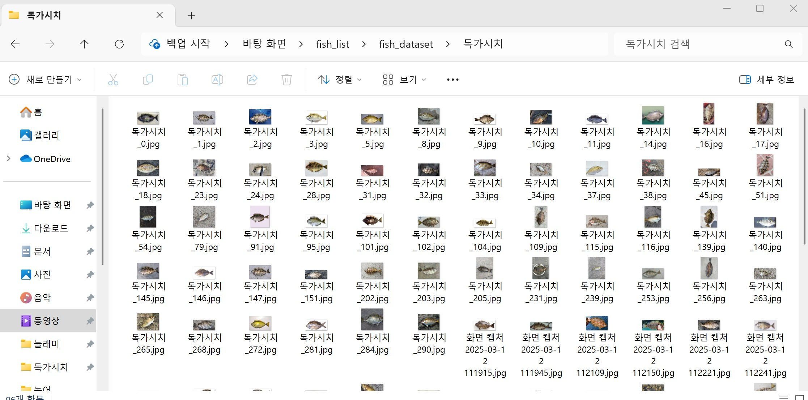

# 📝 TIL: (Today I Learned) (2025-03-04 ~ 2025-03-06)
https://www.notion.so/1ae6458fd4ee805f91f2e4986a043956 진행과정 노션
## 🔹 오늘 한 일

### 1️⃣ 환경 설정
- Python **3.8** 설치
- 필요한 라이브러리 설치 (예: `requests`, `BeautifulSoup`, `selenium`, `opencv` 등)

### 2️⃣ 크롤링 초기 작업
- 물고기 종류 **26종** 설정
- 크롤링 코드 작성 요청 (GPT 활용)
- 크롤링 코드 실행 중 **에러 발생** → 코드 수정
- 수정 후 **또 다른 에러 발생** → 추가 수정 진행
- 관련 에러 노션 기록

### 3️⃣ 이미지 수집 개선
- 수집한 이미지 상태가 **불량**하여 개선 작업 수행
- **설정 변경**:
  - 물고기 26종, **100장씩**, **10번 스크롤** → 수집량 증가 필요
  - 물고기 26종, **300장씩**, **10번 스크롤**, **낚시 관련 키워드 추가**
  - 키워드별 검색 진행
  - **이미지 URL을 따로 저장**하여 중복 다운로드 방지

### 4️⃣ 크롤링 안정화
- **무차별 수집 방지 기능 추가** (네트워크 차단 방지)
- `opencv` 설치 및 적용
- **구글 대신 네이버 검색 사용**으로 전환
- 필터링 적용하여 **불량 이미지 제거**

### 5️⃣ 최종 실행
- 물고기 **26종, 300장씩** 크롤링 완료 🎉

---

## 🔹 배운 점
- 크롤링할 때 **반복적인 에러 수정이 필요**하며, 예외 처리를 철저히 해야 함
- 이미지 크롤링 시 **중복 다운로드 방지**가 중요함
- 구글과 네이버 검색의 차이점을 이해하고 적절한 검색 엔진을 선택하는 것이 필요함
- 필터링을 통해 **불량 이미지 제거**를 자동화하는 것이 품질을 높이는 핵심

---

//

# 📝 TIL (Today I Learned) - 2025-03-07

🚀 오늘 진행한 과정 요약

1️⃣ 데이터 수집 (크롤링)
네이버 이미지 크롤러를 사용하여 감성돔, 갑오징어, 갈치 세 종류의 물고기 이미지를 수집
크롤링한 이미지 중 광고, 사람이 포함된 사진 등의 잘못된 이미지 필터링 시도
OpenCV + OCR(pytesseract)을 활용하여 텍스트 포함된 이미지 제거

2️⃣ 데이터 정리 & 전처리
dataset/ 디렉토리 구조 정리
train, val, test 폴더로 데이터셋 분리
PyTorch ImageFolder를 사용하여 자동으로 데이터 불러오기

3️⃣ 모델 학습 (VGG16)
torchvision.models.vgg16(pretrained=True)를 사용하여 사전 학습된 VGG16 모델 로드
모델의 Fully Connected Layer(classifier[6])를 **3개 클래스(감성돔, 갑오징어, 갈치)**로 수정
데이터 증강(Augmentation) 적용 (RandomHorizontalFlip, RandomRotation)
Adam Optimizer 사용하여 10 Epoch 학습 진행
최종 학습된 모델(fish_classifier.pth) 저장

4️⃣ 모델 테스트 & 예측
fish_test.py에서 저장된 모델을 로드
학습한 모델과 동일한 이미지 전처리 적용 후 테스트 이미지(fish1.jpg)로 예측
model.load_state_dict(torch.load(...)) 시 클래스 개수 불일치 문제 발생 → num_classes = 3으로 수정
CUDA unknown error 발생 → Docker 내에서 GPU 접근 문제로 확인됨
죄다 갑오징어로 분류함. 학습 잘못 됨.

5️⃣ Docker 환경 문제 해결
기존 Docker 컨테이너에 Python 버전 다운그레이드(3.8) 시도했으나 패키지 미지원
docker exec -it -u root 컨테이너명 bash로 컨테이너 내부 진입 후 CUDA 및 PyTorch 환경 확인
nvidia-smi로 GPU 사용 가능 여부 체크
nvcc -V 명령어 실행 불가 → CUDA 관련 패키지 누락 문제 해결 필요

//

# 📝 TIL (Today I Learned) - 2025-03-10

## 🐟 물고기 분류 모델 데이터 전처리

### ✅ 오늘 한 일
- **물고기 분류 AI 모델**에 사용할 26종의 물고기 중 **7종의 물고기 이미지**를 전처리함.
- 주요 전처리 과정:
  - **이미지 리사이징**: 모델 학습에 적합한 크기로 조정.
  - **노이즈 제거**: 불필요한 배경 요소 제거.

### 🔥 내일 할 일
- 국방의 의무

//

# 📝 TIL (Today I Learned) - 2025-03-12

🐟 물고기 분류 모델 데이터 전처리

✅ 오늘 한 일

물고기 분류 AI 모델에 사용할 26종의 물고기 중 2종(망상어, 독가시치의 물고기 이미지를 전처리함.
주요 전처리 과정:

이미지 리사이징: 모델 학습에 적합한 크기로 조정.

노이즈 제거: 불필요한 배경 요소 제거.

부족한 이미지 네이버 이미지 찾아서 추가

//

# 📝 TIL (Today I Learned) - 2025-03-13

🐟 물고기 분류 모델 데이터 전처리

✅ 오늘 한 일

물고기 분류 AI 모델에 사용할 26종의 물고기 중 11종(무늬오징어, 문절망둑, 볼락, 붕장어, 학공치, 국건도움-돌돔, 우럭, 참돔, 복섬, 주하도움-주꾸미, 재민도움-양태)의 물고기 이미지를 전처리함.

주요 전처리 과정:

이미지 리사이징: 모델 학습에 적합한 크기로 조정.

노이즈 제거: 불필요한 배경 요소 제거.

부족한 이미지 네이버 이미지 찾아서 추가

# 📝 TIL (Today I Learned) - 2025-03-14

🐟 물고기 분류 모델 데이터 전처리

✅ 오늘 한 일

물고기 분류 AI 모델에 사용할 26종의 물고기 전체 3163장 이미지를 전처리 완료

주요 전처리 과정:

이미지 리사이징: 모델 학습에 적합한 크기로 조정.

노이즈 제거: 불필요한 배경 요소 제거.

부족한 이미지 네이버 이미지 찾아서 추가

✅ 다음 주 할 일 

ai 물고기 분류 모델 생성 및 테스트

//

# 📝 TIL (Today I Learned) - 2025-03-17

## ✅ Ubuntu Conda & CUDA 세팅
오늘 Ubuntu 환경에서 **Conda 및 CUDA**를 설정 완료!  
이제 물고기 길이 측정 모델을 개발하기 위해 여러 방법을 조사했다.

---

## 🎯 기준 물체 없이 물고기 길이 측정하는 방법

### 1️⃣ **AI 기반 단일 이미지 길이 측정**
기준 물체 없이 물고기 길이를 측정하려면 **AI 기반 깊이(Depth) 추정**이 필요하다.

#### ✅ **방법**
- AI가 사진 속 물고기 위치와 모양을 인식하고, **깊이 정보를 예측**하여 길이를 계산
- 사람이 물고기를 **손에 들거나 평평한 표면에 놓고 촬영**하면 더 정확한 결과 가능

#### 📌 **적용 가능한 기술**
| 기술 | 설명 |
|------|------|
| **MiDaS (MonoDepth)** | 단일 이미지에서 깊이를 추정하는 최신 AI 모델 |
| **YOLO + 크기 예측 모델** | YOLO로 물고기 탐지 후 크기 예측 모델로 길이 계산 |

---

### 2️⃣ **영상(비디오) 기반 길이 측정**
단일 이미지 대신 **영상 촬영**을 활용하면 더 정확한 길이 측정 가능

#### ✅ **방법**
1. 스마트폰으로 물고기를 **2~3초간 촬영**
2. AI가 물고기 모양을 **추적하며 거리와 크기를 계산**
3. 시점 변화(Parallax)를 활용하여 **3D 정보 생성**

#### 📌 **적용 가능한 기술**
| 기술 | 설명 |
|------|------|
| **SfM (Structure from Motion)** | 여러 프레임을 분석하여 3D 정보 생성 |
| **NeRF (Neural Radiance Fields)** | 2D 이미지를 학습하여 3D 모델 생성 |
| **DeepLabCut (포즈 추적)** | 물고기 머리-꼬리 포인트 검출 후 길이 측정 |

---

## 🎯 최종 선정한 방법 (고성능 GPU 필요 기술 제외)

### ✅ **스마트폰 기반 길이 측정 모델**
1. **YOLOv8** → 물고기 인식 & 윤곽 감지
2. **DeepLabCut** → 머리-꼬리 검출 & 길이 측정
3. **OpenCV 거리 변환** → 픽셀 값을 실제 길이(cm)로 변환

| 기능 | 추천 기술 | 이유 |
|------|---------|-----|
| 물고기 인식 & 윤곽 추출 | YOLOv8 + DeepLabV3 | 정확한 물고기 윤곽 감지 |
| 머리-꼬리 검출 & 길이 측정 | DeepLabCut | AI가 자동으로 포인트 검출 |
| 길이 변환 (픽셀 → cm) | OpenCV 거리 보정 | 스마트폰 카메라 거리 활용 |

### 📌 **구현 과정**
1️⃣ 스마트폰으로 물고기 촬영  
2️⃣ **YOLOv8**이 물고기를 탐지하고 윤곽 감지  
3️⃣ **DeepLabCut**이 머리-꼬리 포인트 검출  
4️⃣ 픽셀 길이를 **실제 길이(cm)** 로 변환  

📌 **길이 변환 공식**
실제_길이(cm) = (픽셀_길이 × 실제_거리) / 카메라_초점_길이
카메라 거리(Depth)는 ARKit / ARCore로 측정 가능
일반 스마트폰에서도 거리 측정 가능

🏗️ 다음 할 일

📌 물고기 데이터 라벨링 진행 중
📌 YOLOv8 + DeepLabCut 기반 길이 측정 모델 개발

//

# 📝 TIL (Today I Learned) - 2025-03-18
물고기 윤곽 및 키포인트 검출 모델 라벨링 진행

📌 1️⃣ YOLOv8 / DeepLabV3 → 물고기 윤곽 검출
이미지에서 물고기의 전체 윤곽을 인식하여 배경과 분리하는 역할
Instance Segmentation 수행
총 784장의 이미지 라벨링 완료

📌 2️⃣ DeepLabCut → 머리-꼬리 좌표 검출
물고기 머리(코 끝)와 꼬리 끝을 Keypoint Detection으로 인식
픽셀 단위로 머리~꼬리 거리 계산 가능
총 1,096장의 이미지 라벨링 진행 완료

✅ 라벨링 현황
Keypoint Detection: 1,096장
Instance Segmentation: 784장

📌 라벨링 마저 진행예정 🚀

//

# 📝 TIL (Today I Learned) - 2025-03-19
물고기 윤곽 및 키포인트 검출 모델 라벨링 진행

📌 1️⃣ YOLOv8 / DeepLabV3 → 물고기 윤곽 검출
이미지에서 물고기의 전체 윤곽을 인식하여 배경과 분리하는 역할
Instance Segmentation 수행
오늘 662장의 이미지 라벨링 완료

✅ 라벨링 현황
Keypoint Detection: 1,096장
Instance Segmentation: 1446장

📌 라벨링 마저 진행 예정 🚀

//
# 📝 TIL (Today I Learned) - 2025-03-19
발표자료 준비로 pass
# 📝 TIL (Today I Learned) - 2025-03-20
발표준비 및 발표로 pass

//

# 📝 TIL (Today I Learned) - 2025-03-24
물고기 윤곽 및 키포인트 검출 모델 라벨링 진행

📌 1️⃣ YOLOv8 / DeepLabV3 → 물고기 윤곽 검출
이미지에서 물고기의 전체 윤곽을 인식하여 배경과 분리하는 역할
Instance Segmentation 수행
오늘 1091장의 이미지 라벨링 완료

✅ 라벨링 현황
Keypoint Detection: 1,096장
Instance Segmentation: 2,537장

📌 라벨링 마저 진행 예정 🚀

//

# 📝 TIL (Today I Learned) - 2025-03-25
물고기 윤곽  검출 모델 라벨링 완료

📌 1️⃣ YOLOv8  → 물고기 윤곽 검출
이미지에서 물고기의 전체 윤곽을 인식하여 배경과 분리하는 역할
Instance Segmentation 수행
물고기 윤곽 검출 모델 테스트 성능 높음

돌돔에서만 몇 장의 이미지 윤곽검출실패 - > 돌돔만 추가로 이미지 증강, 정확도 높이는 방법 연구필요

✅ 라벨링 현황
Keypoint Detection: 1,096장
Instance Segmentation: 3,191장

📌 라벨링 마저 진행 예정 🚀
꼬리-머리 길이 측정 모델 개발

//

# 📝 TIL (Today I Learned) - 2025-03-26
물고기 윤곽  검출 모델 변환

변환 순서:
PyTorch → ONNX → TensorFlow → TFLite

변환 이유:
Flutter+ARCore 앱에서 사용하기 위해 TFLite 필요
자동 윤곽 탐지 기반 길이 측정 기능 구현 목적

💥 TFLite 변환 중 문제 발생
문제 현상:
PyTorch에서는 정상 작동

TFLite에서는 윤곽 못 찾음 (정확도 처참)

8시간 동안 구른 이유:
TFLite 정확도 낮음 → sigmoid 미적용 때문!
변환 시 내부 코드 수정 필요

📌 내일 할 일 : 길이 측정 모델 개발🚀
