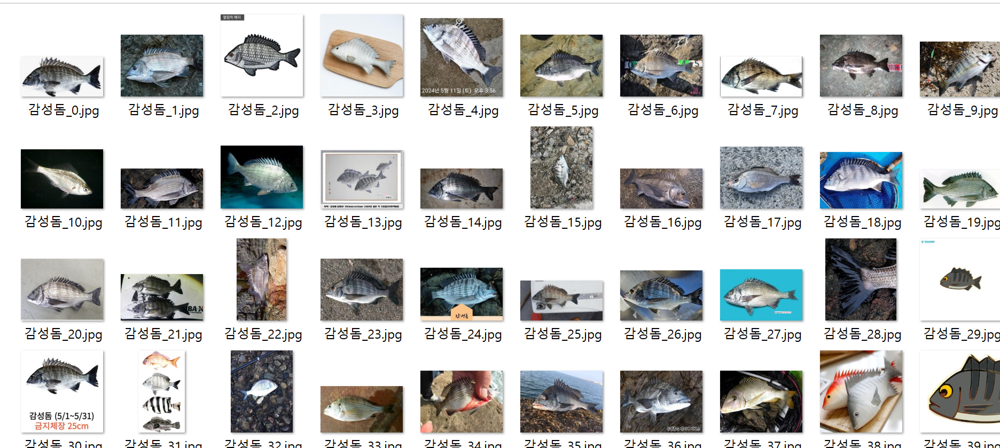

# 🐟 TIL: 물고기 크롤링 진행 과정 (2025-03-04 ~ 2025-03-06)
https://www.notion.so/1ae6458fd4ee805f91f2e4986a043956 진행과정 노션
## 🔹 오늘 한 일

### 1️⃣ 환경 설정
- Python **3.8** 설치
- 필요한 라이브러리 설치 (예: `requests`, `BeautifulSoup`, `selenium`, `opencv` 등)

### 2️⃣ 크롤링 초기 작업
- 물고기 종류 **26종** 설정
- 크롤링 코드 작성 요청 (GPT 활용)
- 크롤링 코드 실행 중 **에러 발생** → 코드 수정
- 수정 후 **또 다른 에러 발생** → 추가 수정 진행
- 관련 에러 노션 기록

### 3️⃣ 이미지 수집 개선
- 수집한 이미지 상태가 **불량**하여 개선 작업 수행
- **설정 변경**:
  - 물고기 26종, **100장씩**, **10번 스크롤** → 수집량 증가 필요
  - 물고기 26종, **300장씩**, **10번 스크롤**, **낚시 관련 키워드 추가**
  - 키워드별 검색 진행
  - **이미지 URL을 따로 저장**하여 중복 다운로드 방지

### 4️⃣ 크롤링 안정화
- **무차별 수집 방지 기능 추가** (네트워크 차단 방지)
- `opencv` 설치 및 적용
- **구글 대신 네이버 검색 사용**으로 전환
- 필터링 적용하여 **불량 이미지 제거**

### 5️⃣ 최종 실행
- 물고기 **26종, 300장씩** 크롤링 완료 🎉

---

## 🔹 배운 점
- 크롤링할 때 **반복적인 에러 수정이 필요**하며, 예외 처리를 철저히 해야 함
- 이미지 크롤링 시 **중복 다운로드 방지**가 중요함
- 구글과 네이버 검색의 차이점을 이해하고 적절한 검색 엔진을 선택하는 것이 필요함
- 필터링을 통해 **불량 이미지 제거**를 자동화하는 것이 품질을 높이는 핵심

---

