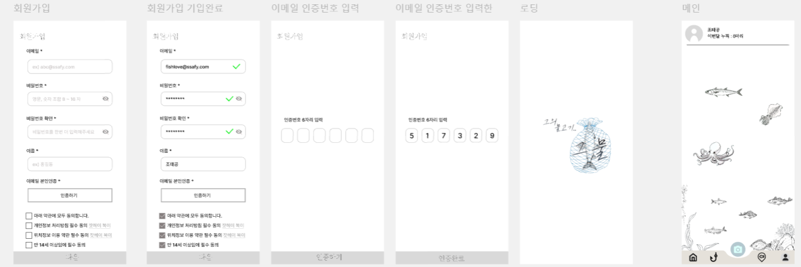
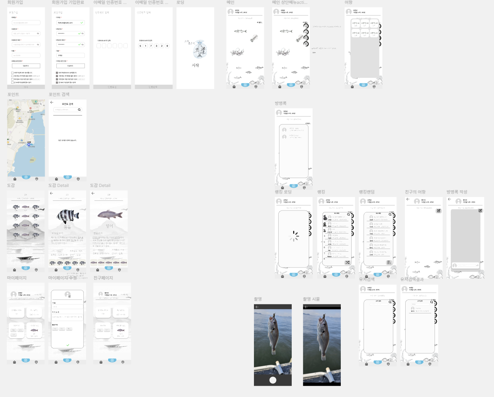
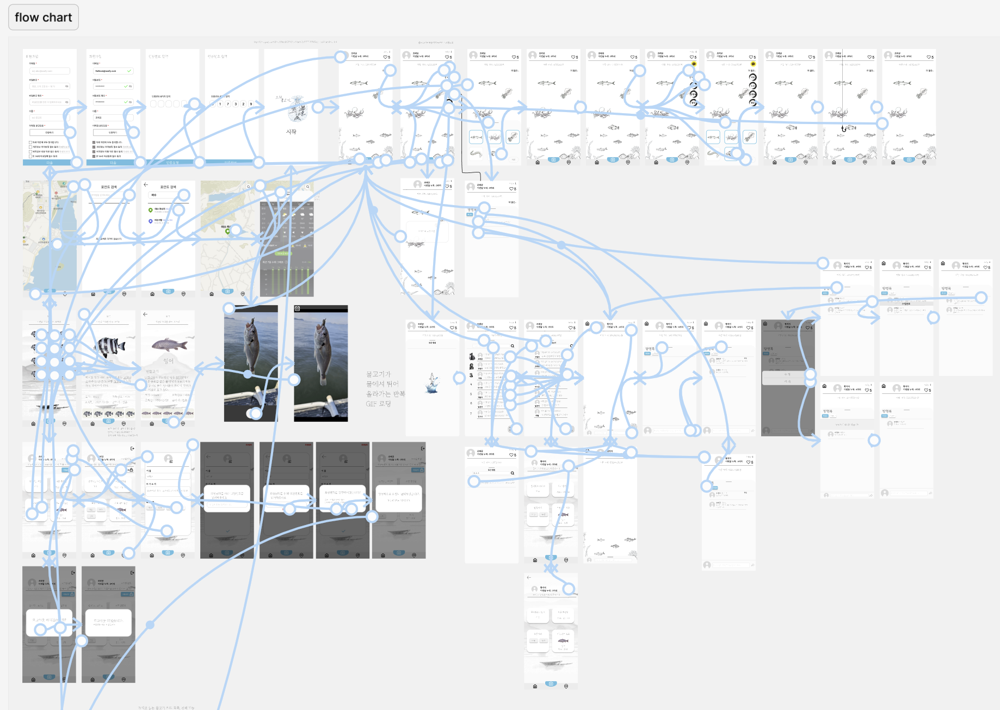
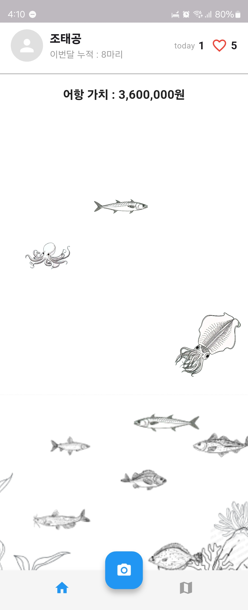

# TIL (Today I Learned) - 2025-03-05

## 📅xxxx-xx-xx

### **📖오늘 배운 내용**

### **🧐 회고**

### **🎯 내일 목표**
 

## Flutter와 Dart

### 📝 Flutter란?
- **Flutter**는 Google에서 개발한 **오픈 소스 UI 프레임워크**로, 단일 코드베이스로 **iOS, Android, 웹, 데스크톱** 앱을 개발할 수 있다.
- **Dart 언어**를 사용하며, **빠른 개발(Hot Reload), 아름다운 UI, 높은 성능**이 특징이다.
- **Flutter의 주요 구성 요소:**
  - **Widget**: Flutter의 UI 요소 (StatelessWidget, StatefulWidget)
  - **Flutter Engine**: Dart로 작성된 렌더링 엔진
  - **Packages & Plugins**: 다양한 기능 확장을 위한 라이브러리

### 🔤 Dart란?
- **Dart**는 Google이 개발한 **프로그래밍 언어**로, Flutter의 기본 언어이다.
- **객체 지향 언어(OOP)**이며, JavaScript와 비슷한 문법을 가지고 있다.
- **JIT(Just-In-Time)과 AOT(Ahead-Of-Time) 컴파일**을 지원해, 빠른 개발과 최적화된 성능을 제공한다.
- 주요 문법 특징:
  - **변수 선언**: `var`, `final`, `const`
  - **함수**: `void`, `return` 키워드 사용
  - **클래스와 객체**: `class`, `this`, `new` 키워드 사용 가능 (new는 선택적)
  - **비동기 프로그래밍**: `async`, `await`, `Future` 지원

### ✨ 오늘의 배운 점
- Flutter는 **크로스 플랫폼 개발**에 유용하다.
- Dart는 **객체 지향 언어**이며, JavaScript와 문법이 유사하다.
- **Hot Reload 기능**을 사용하면 UI 변경 사항을 즉시 확인할 수 있다.

-  
# TIL (Today I Learned) - 2025-03-06

## Figma 로 어항구조를 잡았고, 앱 제작에있어 필요한 물고기들의 이미지를 AI를 활용해 제작함.
- Adobe **FireFly 라는 AI 이미지 생성 페이지** 를 이용해 asset 제작 가능하다.

  
- 
# TIL (Today I Learned) - 2025-03-07
**Flutter 환경세팅**

Flutter 3.29.0 • channel stable • https://github.com/flutter/flutter.git
Framework • revision 35c388afb5 (3 weeks ago) • 2025-02-10 12:48:41 -0800
Engine • revision f73bfc4522
Tools • Dart 3.7.0 • DevTools 2.42.2

처음 flutter 3.29.0 다운받고 documents 위치에 압축해제를 한 후 bin 폴더 들어가 경로를 복사 후 윈도우 환경변수 path 세팅에 들어가 새로만들기 후 주소를 붙여넣기 하였으나,

설치가 완료되지않아, 문제 분석중 발견된 문제는 , OneDrive 가 실행되고있을 경우 환경변수 세팅에 영향을 끼치는것으로 보여, OneDrive 종료 후 재부팅 후 압축해제를 다시 해보니 해결이 되었다.

Android Studio Meerkat 설치완료 후
flutter 연결 완료

  
# TIL (Today I Learned) 2025-03-10
금일 피그마 프론트 화면 구성 진행했다.
오랜만에 피그마 만지려니 매우매우 어색하여 구글링을 통해
컨텐츠 배치부터 시작해 최대한 깔끔한 UI 를 만들려 노력했다.
메인페이지 구상하는데 시간을 좀 많이 썼는데, 알고보니
어항페이지가 메인페이지였다. 소통에 신경 많이 써야겠다.

  

## 📅2025-03-12

### **📖오늘 배운 내용**
피그마 디자인 계속해서하는데 어떻게하면 최대한
사용자 친화적인 UI를 만들 수 있을까 고민하고 공부했다.

### **🧐 회고**
디자인은 주관이라 매우 어려운것같다.. 매우.. 나에겐
더더욱 더욱 .. 어렵다. 디자이너들 존경스럽다.
### **🎯 내일 목표**
내일은 예비군을 가기때문에, 전시를 대비해
철저히 준비를 하겠다.
 

## 📅2025-03-13

### **📖오늘 배운 내용**
오늘 피그마를 끝내고 flutter , dart 공부를 할 줄 알았으나,
정말 세부적으로 구성을 끝내면 개발때 편할 것 같다는 느낌을 받아서
디테일적으로 조금 더 신경쓰기로 결정이났다. 그래서 ,, 디테일적인 요소를 추가하고
모달모양을 요즘 트렌드에 맞게 바꾸었다. (자료찾는데 시간을 좀 쓴 것 같다)
### **🧐 회고**
flutter가 조금은 슬슬 걱정이다. 주말에 시간을 좀 투자해서 문법은 공부를 좀 해야할 것 같다.
(미대를 나왔으면 여기서 인기 폭발이겠지?)
### **🎯 내일 목표**
정말 정말 정말 진짜 찐 엔딩을 보고 말 것. 피그마 깔끔하게 끝내고 , flutter 공부를 할 수 있도록..
 

## 📅2025-03-14

### **📖오늘 배운 내용**
오늘 피그마를 찐으로 끝내고 flutter , dart 공부를 할 줄 알았으나,
세부적에 더해 더 세부적으로 구조를 짜는데 시간을 모두 써버렸다.
그래서 완전한 최종 피그마를 끝내는데에는 성공하였다..(사실 3-16 일요일 해버렸다..)

### **🧐 회고**
flutter 를 좀 자세히 공부하고싶었으나, 이제부터 개발주를맞이하기때문에
박치기식으로 진행해야할것같다. 굉장히 걱정인건,
애니메이션을 구현하는것들이 조금 걱정이다.
### **🎯 내일 목표**
3-17부턴 개발! 박치기해보는것이다.
나를 믿는다. 난 할 수 있다. 수단과 방법을 가리지않고
완성만 된다면, 그걸로 된다는 마인드로 속전속결로 해보자.
할 수 있다.
 

## 📅2025-03-17

### **📖오늘 배운 내용**
결국 figma 목업 + 와이어프레임 끝내고, flutter 공부를 시작했다.
오늘은 개발을위한 세팅을 진행했다. 생각보다 오래걸려서 놀랐다.

react 를 한 배경지식으로 폴더들을 구성했다. 중간에 폴더 하나를 깜빡하고 생성을 안했더니,
하위 파일들이 상위폴더의 이름을 코드로 쓰는것을 merge 하기 전, 

changes 창에서
확인해서, merge 를 하지않고 하위파일들의 코드를 수정하는데 시간을 좀 할애했다.

추가로, 같은 프론트엔드 동료와 회의를했다. 당장 나무를 벨 것인지, 도끼를 갈아서 벨 것인지에 대한
회의를 진행했다. 

그래서 컨설턴트님께 나의 동료가 질문을 한것 같았다. 다행히 MVP 는 어떤것이 되는지에대한
확인 검증 단계인것같아서, 프론트엔드 화면이 완성되지 않아도 된다는 사실에 도끼를 준비하는 결과가 나왔다.
### **🧐 회고**
figma 로는 화려한 애니메이션을 많이 넣었다. 인간은 상호작용할때 쾌감을 얻는다는 나의 경험을 의식하며
애니메이션에 힘을 좀 쏟았다. 

하지만, 걱정은 이제 이런 애니메이션 효과들을 실제로 구현 할 수 있을것인가.
그것이 문제다. 걱정은 좀 된다. 그치만 어쩌겠나, 해내야겠다.
### **🎯 내일 목표**
내일은 도끼를 마저 갈고, 감이 잡히기 시작하면 바로 개발에 들어갈 수 있게, 하곘다. 할 수 있다.
 

## 📅2025-03-18 이지만 현재시간은 3-19 04:16

### **📖오늘 배운 내용**
오늘은 flutter 강의를 봤다. dart 문법공부와 flutter 파일구조, flutter 코드구조
정도 익혔다. 음.. 일단 dart 정말? 나랑 안맞다. 직관적이지 않다.
난 react lover 다.
### **🧐 회고**
일단 오늘 싸피 있는동안은 정말 공부만 했던 것 같았다. 그리고 같이하는 국건동료와
파일구조에 대해 회의를 해서 앞으로 이런이런 구조로 가자 라는 합의를 봤다.
flutter , dart 하면서 조금 회의감이 들었다.
뭔가 flutter dart 아는게 없으니, 나의 존재감을 펼치지 못해서 인가.
팀에 많은 도움이 되고싶다. 그래서 지금 새벽 4시20분까지 잔업을 했더니 메인페이지 봐줄만하다.
싸피끝나고 개인프로젝트로 얼른 iot 만지작 해보고싶다.
원래 2024년1월부터 잡은 목표는 iot 쪽이였는데,, 웹과 앱을 만들고있으니, 스트레스가 좀 있던 날이였다.

결과물

### **🎯 내일 목표**
좀있다? 목표라고 해야하나,
상호작용 부분을 좀 건드릴 생각이다. Gpt선생님과 하다가 막히면 근본적으로 어디부분이
문제인지 파악하고 직접 수정할 계획이다. (flutter 공부와 함께 병행하며..)
 

## 2025-03-19

### **📖오늘 배운 내용**
오늘은 .. 메인페이지(수족관)에서 물고기 터치이벤트를 만들었다.
일단은 멈추게 만들었다. 그리고 색깔입히는건 추후에 만들 예정이다.
후순위 , 하지만 언젠간 선순위로 바뀔 수도.. flutter 진짜 어렵다..
### **🧐 회고**
성장하는걸 느낀다. 재밌다. 심장이 뛴다. 하지만? 어렵다..
gpt 써가면서 공부하면서 코딩하고있다.
### **🎯 내일 목표**
목금 결석이슈로 월요일은 메인페이지 상단탭을 만들어 보겠다.
 

## 📅2025-03-24

### **📖오늘 배운 내용**
오늘은 메인페이지에서의 상단탭을 구현해봤다.
더많은.. 을 터치하면 세로로 쫘라라락 하고 나타나는걸 하는데
드랍다운이 많이 어려웠다.
세로구도로 나타나는건데, 한번에 아래로 미끄러지는건 쉬운데,
한 점에서 밑으로 펼쳐지는건 미치도록 어려웠다.
GPT선생님 감사합니다. 코드 잘 이해해보겠습니다.
### **🧐 회고**
프론트엔드 하면할수록 앞으로가 걱정이다.
피그마로는 매끄럽게 만들어놨지만,
그걸 구현하는게 걱정이다.
그치만 피그마로 만들었던거를 실제 앱으로 만들어가는 과정이
내 심장을 뛰게 만든다.
### **🎯 내일 목표**
물고기 색깔 이벤트, + 물고기 퐁당 + 물고기 삭제 
구현해보려한다.
 

## 📅2025-03-25

### **📖오늘 배운 내용**
오늘은 flutter 개발 + 공부 했다. 여전히 어렵다.
함수 하나하나 어떻게 동작하는지 궁금해서 찾아보고싶지만,,
그렇게 하면 마감까지 못할 것 같다.
컨설턴트님과 상담을 했는데, 너무 좋은 시간이였다.
### **🧐 회고**
시간이 너무 빠르다. 시간투자를 조금 더 해야겠다.
작업속도를 1.5배 빠르게 해야겠다.
### **🎯 내일 목표**
어제의 목표인 퐁당 , 삭제, 못했다.
우선 페이지들과 모달들을 우선시하면서
개발할 예정이다. 도감페이지 + 도감페이지디테일 해야겠다.
 

## 📅2025-03-25

### **📖오늘 배운 내용**

### **🧐 회고**

### **🎯 내일 목표**
 
