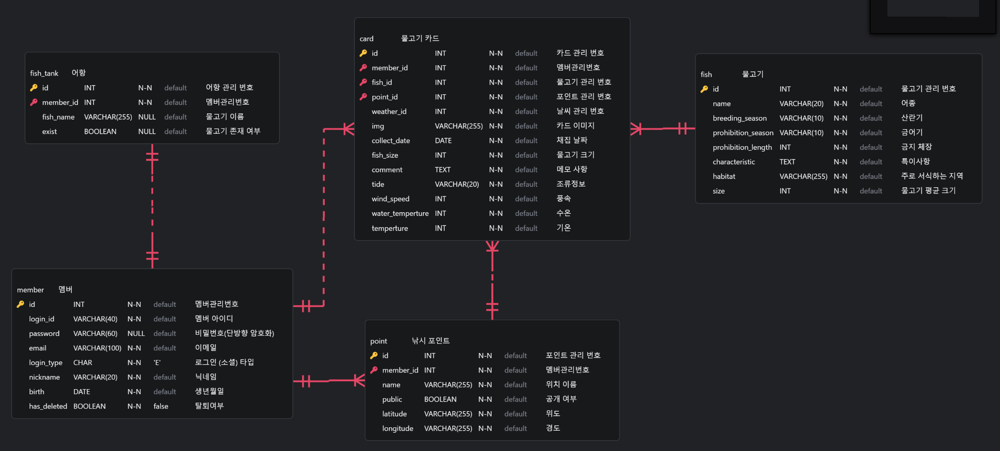

## ERD 🖥️
---

추후에 커뮤니티가 생기면 relation 추가 예정 (아마 X)

---  
### 정규화 👌
**1NF**: 테이블의 모든 속성은 원자값  
**2NF**: 부분적 함수  종속 제거  
**3NF**: 이행적 종속 제거  
**BCNF**: 모든 결정자가 후보키가 되도록 변환  
**4NF**: 다치 종속 제거  
**5NF**: 조인 종속성 이용  

### 무결성 규칙 👌
-> 데이터의 정확성과 일관성을 유지하기 위한 규칙

**개체 무결성**   
기본 키(PK)는 중복되거나 NULL이 될 수 없음
각 행을 식별할 수 있도록 고유해야 함  

**참조 무결성**    
외래 키(FK)는 참조하는 테이블의 기본 키 값을 가져야 함  
참조하는 데이터가 삭제되면 연쇄 삭제 또는 제한 필요  

**도메인 무결성**  
컬럼의 데이터 타입과 허용값을 제한하여 잘못된 데이터 입력 방지  

**고유 무결성**    
특정 컬럼이 유일한 값을 가져야 함
PK와 다르게 NULL을 허용할 수도 있음
