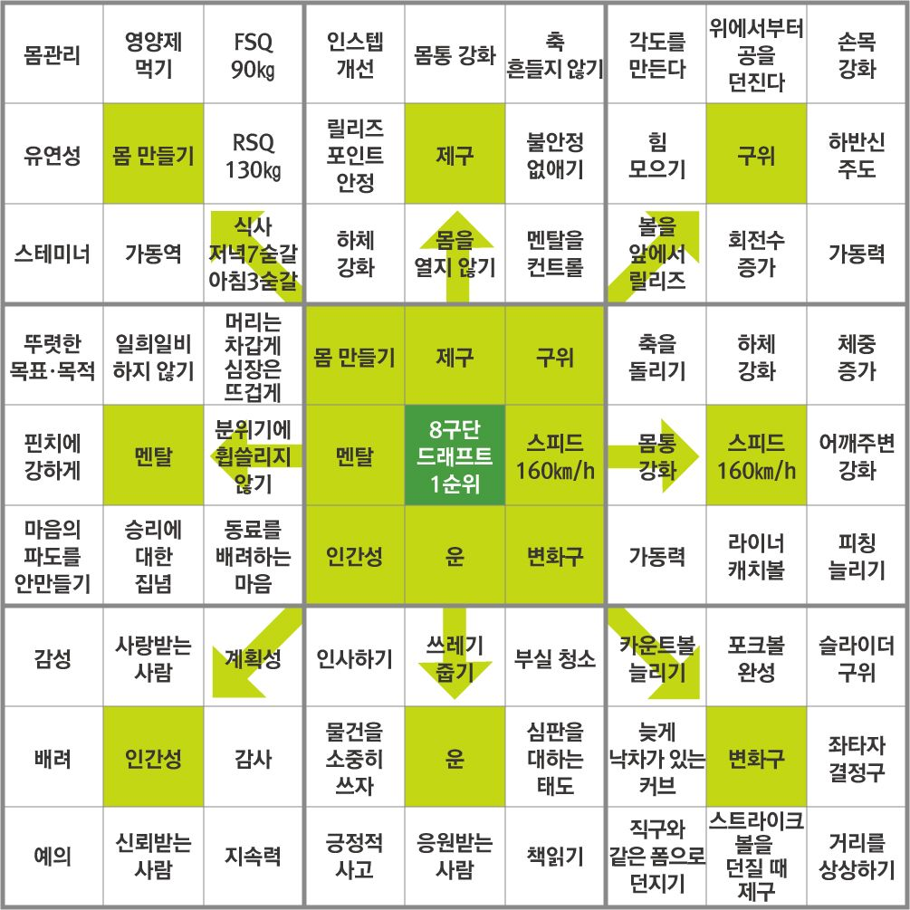

# 📚 Today I Learned
for '그물' PJT

### Form

## 📅xxxx-xx-xx

### **📖오늘 배운 내용**

### **🧐 회고**

### **🎯 내일 목표**

---

## 📅2025-03-06

**📖오늘 배운 내용**
- 아이디어 회의를 할때는 주로 아침에 하는 것이 좋은 것 같다.
- Back-End Frame work란?\
개발자에게 서버 측 애플리케이션 개발을 위한 데이터 액세스와 웹 서비스와 같은 백엔드 구성 요소를 제공\
 Ex) Spring boot, FastAPI, Django, NodeJS 같은 것들이 있다.
- 3가지 종류의 사람이 있다. Giver, Matcher, Taker. Giver가 많아야 좋은 집단이 된다. 
**🧐 회고**\
이번 프로젝트는 Spring boot 프레임워크를 활용하기로 했다.
선정한 이유는
- 가장 많이 사용하는 프레임워크.
- 딥하게 공부할 수 있음.
- 국내에선 해당 프레임 워크 인지도가 높음.

**🎯 내일 목표**\
Spring boot 학습

---

## 📅2025-03-07(FRY)

### **📖오늘 배운 내용**
- 만트라트

### AI Tools
- Amazone Q
- TLDraw (내가 그린 그림을 AI가 보정해주는 것)

### 오늘 한 것
- [CUDA Set UP](https://www.notion.so/CUDA-SetUp-1afbcffe6c8f802593ade7c965b685ef?pvs=4)
- [pytorch를 활용하여 이미지 분류 예제](https://tutorials.pytorch.kr/beginner/blitz/cifar10_tutorial.html)

### **🧐 회고**
오늘은 금요일이라 조금 붕뜬 느낌이였지만, 차근차근 할일을 해내가야겠다. 백엔드 지식을 학습할 필요가 있다.

### **🎯 내일 목표**
- 물고기 데이터를 학습하여, 테스트
- 백엔드 학습