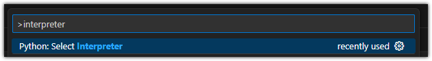

## MiniConda 설치

1. MiniConda 설치
mini conda 설치 쉘스크립트
https://repo.anaconda.com/miniconda/Miniconda3-latest-Linux-x86_64.sh

    
    쉘스크립트의 퍼미션을 실행가능하도록 변경
    
    ```bash
    chmod +x Miniconda3-latest-Linux-x86_64.sh
    ```
    
    쉘 스크립트 실행하여 설치
    
    ```bash
    ./Miniconda3-latest-Linux-x86_64.sh
    ```
    
    엔터
    q
    yes
    엔터
    yes
    누르기
    설치 완료 후 새로 터미널 열면, 앞에 (base)가 추가 됨.
    아래 처럼 확인
    
    ```bash
    (base) chichi@chichi:~$ python
    Python 3.12.9 | packaged by Anaconda, Inc. | (main, Feb  6 2025, 18:56:27) [GCC 11.2.0] on linux
    Type "help", "copyright", "credits" or "license" for more information.
    >>> import sys
    >>> sys.executable
    '/home/chichi/miniconda3/bin/python'
    >>> quit()
    (base) chichi@chichi:~$ 
    
    ```
    
2. 가상환경 만들기

```bash
conda create -n tf_pjt python=3.10
```

```bash
# 환경 디렉토리 확인
## Package Plan ##

  environment location: /home/chichi/miniconda3/envs/tf_pjt
  
  
# 아래 활성화 방법 확인                                                                            
# To activate this environment, use                                             
#                                                                               
#     $ conda activate tf_pjt
#
# To deactivate an active environment, use
#
#     $ conda deactivate

conda env list > 가상환경 목록 확인

conda env remove -n ${my_env} > 가상환경 삭제 명령어
```

3. 가상환경 활성화 

```bash
(base) chichi@chichi:~$ conda activate tf_pjt
(tf_pjt) chichi@chichi:~$
```

4. Conda에서 생성한 가상환경으로 VScode에서 변경
Ctrl + Shift +P를 누른 후, interpreter를 입력하여 검색되는 다음 항목을 선택
아래 처럼 확인
    
    
    
    .png)
    

## NVIDIA 그래픽 카드 드라이버 설치

1. Ubuntu 22.04에 NVIDIA 그래픽 카드 드라이버 설치
2. 그래픽 카드 모델과 그래픽 드라이버 확인

```bash
sudo lshw -c display
```

```bash
  *-display
       description: VGA compatible controller
       product: Intel Corporation
       vendor: Intel Corporation
       physical id: 2
       bus info: pci@0000:00:02.0
       logical name: /dev/fb1
       version: 08
       width: 64 bits
       clock: 33MHz
       capabilities: pciexpress msi pm vga_controller bus_master cap_list rom fb
       configuration: depth=32 driver=i915 latency=0 resolution=2880,1800
       resources: iomemory:520-51f iomemory:420-41f irq:205 memory:5220000000-5220ffffff memory:4210000000-421fffffff memory:c0000-dffff memory:4202000000-4208ffffff
  *-graphics
       product: simpledrmdrmfb
       physical id: 2
       logical name: /dev/fb0
       capabilities: fb
       configuration: depth=32 resolution=2880,1800
```

위 와 같이 확인

```bash
sudo ubuntu-drivers devices
```

```bash
(base) chichi@chichi:~$ sudo ubuntu-drivers devices
== /sys/devices/pci0000:00/0000:00:01.0/0000:01:00.0 ==
modalias : pci:v000010DEd000028A1sv0000144Dsd0000C1D8bc03sc02i00
vendor   : NVIDIA Corporation
driver   : nvidia-driver-535 - distro non-free
driver   : nvidia-driver-535-server-open - distro non-free
driver   : nvidia-driver-545 - distro non-free
driver   : nvidia-driver-545-open - distro non-free
driver   : nvidia-driver-570-server - distro non-free
driver   : nvidia-driver-550 - distro non-free recommended
driver   : nvidia-driver-550-open - distro non-free
driver   : nvidia-driver-535-open - distro non-free
driver   : nvidia-driver-570-server-open - distro non-free
driver   : nvidia-driver-535-server - distro non-free
driver   : xserver-xorg-video-nouveau - distro free builtin
```

위 와 같이 nvidia-driver-535 확인

```bash
sudo apt install nvidia-driver-535
```

설치 후 컴퓨터 재부팅

```bash
sudo lshw -c display
```

다시 확인하면 Configure 항목에 nvidia로 바뀜.

## CUDA cuDNN 설치

### 1. 본인 GPU에 맞는 CUDA 확인하기
확인하는 법.
https://developer.nvidia.com/cuda-gpus  
이 프로젝트에서는 양자화 라이브러리와 호환 가능한 텐서 버전에 맞춰준다 

**CUDA 11.8 Download**
```bash
sudo apt update
sudo apt install wget
wget https://developer.download.nvidia.com/compute/cuda/11.8.0/local_installers/cuda_11.8.0_520.61.05_linux.run
sudo sh cuda_11.8.0_520.61.05_linux.run
# 드라이버 설치는 'n'
```

**cuDNN Download** -> 직접 다운로드 후 실행한다(cuDNN v8.6.0) https://developer.nvidia.com/rdp/cudnn-archive
```bash
cd ~/Download
tar -xzvf cudnn-linux-x86_64-8.6.*.tgz
sudo cp -P cuda/include/cudnn*.h /usr/local/cuda-11.8/include/
sudo cp -P cuda/lib64/libcudnn* /usr/local/cuda-11.8/lib64/
sudo chmod a+r /usr/local/cuda-11.8/include/cudnn*.h /usr/local/cuda-11.8/lib64/libcudnn*
```

--- 
### 2. Tensorflow version 확인   
양자화에 필요한 tensorflow-model-optimization==0.7.5 를 위해서는 

```bash
# pip 버전 TensorFlow 2.13 (GPU 지원 포함)
pip install tensorflow==2.13.0

# Model Optimization Toolkit
pip install tensorflow-model-optimization==0.7.5

# typing_extensions 버전 고정 (에러 방지)
pip install typing-extensions==4.7.1

```

--- 
### 3. 환경변수 설정
```bash
echo 'export PATH=/usr/local/cuda-11.8/bin:$PATH' >> ~/.bashrc
echo 'export LD_LIBRARY_PATH=/usr/local/cuda-11.8/lib64:$LD_LIBRARY_PATH' >> ~/.bashrc
source ~/.bashrc

```
 
--- 
### 4. 설치 && GPU 확인
```bash
nvcc --version            # CUDA 버전 확인

nvidia-smi                # 드라이버 동작 확인

ls /usr/local/cuda/lib64 | grep libcudnn   # cuDNN 설치 확인

python -c "import tensorflow as tf
print(tf.config.list_physical_devices('GPU'))"
```

위 입력 후,
실행 결과 마지막에 [PhysicalDevice(name='/physical_device:GPU:0', device_type='GPU')] 처럼 보이면 Tensorflow에서 GPU를 사용할 수 있습니다. 

### Tensorflow < 2.14 ver 설치 시

https://webnautes.tistory.com/1844